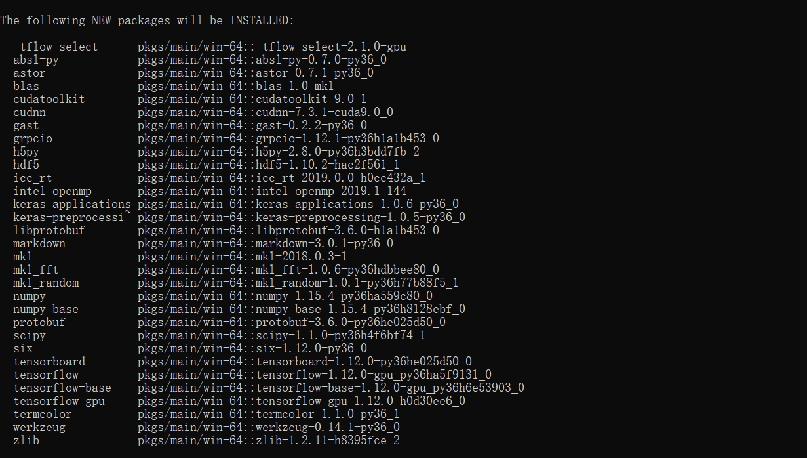

### TensorFlow-gpu
在使用anaconda创建好一个新的python环境后，就可以开始TensorFlow-gpu的安装。  
照例是去网上寻找教程，不过会发现，中文网络下的教程都是要求手动下载和安装CUDA和cudnn，并且必须要下载安装特定的对应版本才能运行。显然这样非常麻烦复杂。

#### 传统方法
要为GPU安装Tensorflow，必须按照以下步骤操作（步骤适用于Windows）：  
1. 首先找出GPU是否与Tensorflow GPU兼容！
2. 下载并安装Cuda Toolkit 。
3. 通过注册Nvidia开发人员网站下载cuDNN
4. 通过将cuDNN的内容解压缩到步骤2中安装的Toolkit路径来安装cuDNN。将有一些文件必须在CUDA Toolkit目录中替换。
5. 然后需要检查是否存在CUDA_HOME的路径变量。如果没有，请手动添加。
6. 如果Toolkit路径可用，请检查路径变量。
7. 然后最后安装Anaconda或Miniconda
8. 使用安装了Python和Pip包创建环境。
9. 然后最后' pip install tensorflow-gpu'。
10. 测试安装。

不过在机器之心和国外的[网站](https://towardsdatascience.com/tensorflow-gpu-installation-made-easy-use-conda-instead-of-pip-52e5249374bc)查到了一个简易的安装方法，可以直接使用conda install tensorflow-gpu命令。

``` 
conda create --name tf_gpu
activate tf_gpu
conda install tensorflow-gpu
```
前两行命令是创建新的Python虚拟环境，前文已经叙述，任意命名。

运行最后一行命令后，会开始执行安装：


<center>将要安装的pkgs</center>

这里有一个问题非常值得注意，如果曾在安装anaconda是，修改过.condarc中的镜像源，比如改成国内的清华源镜像或中科大的。那么执行`conda install tensorflow-gpu`命令后，下载的将不是上述pkgs，国内清华conda镜像中下载的tensorflow包的版本是不对的，专门去它网站上查看，发现是1.10版本的，cudnn版本也是6.0，cudatoolkit是8.0。网上去查了下对应版本的问题，似乎是对不上的，就算能对上，我想也不一定适用于我电脑的GPU版本。  
然后又去翻了中科大的镜像，发现和清华是一样的。

也就是说，安装tensorflow-gpu时，别用国内的镜像源，否则下载的是`tensorflow1.10`版本，很大可能是无法运行的。把.**condarc文件删除**，`conda install tensorflow-gpu`安装会使用默认的地址（应该是anaconda cloud上的）。这样下载的包才是兼容可运行的。  
不过这样存在的问题就是，下载速度会非常的慢（否则为什么要用国内的conda镜像呢）。  
运行`conda install tensorflow-gpu`命令后，将会显示出将要安装的各个包的具体版本，以及包的安装路径，那么就可以自己提前从网上下载好正确的包放在正确的路径中，这样或许能够跳过下载，实现快速安装。在anaconda cloud，会发现以上所有的不同版本的包都是有的，直接下载，速度非常快。将下载好的包放入pkgs文件夹。重新执行`conda install tensorflow-gpu`。速度果然提上去了（这里我对照查看了pkgs文件夹中的包，发现安装到某个包时，包的状态会发生变化-可能是校验？当然不排除重新下载覆盖的可能，但这样难以解释速度的大幅提升）。  
等待安装结束，运行测试命令：
```
import tensorflow as tf
hello = tf.constant('Hello, TensorFlow!')
sess = tf.Session()
print(sess.run(hello))
输出：
b’ Hello, TensorFlow!
```
TensorFlow-gpu安装成功！

### 关于pip的一些小问题

anaconda的python和原生python可能的冲突

`Could not install packages due to an EnvironmentError: [WinError 5] 拒绝访问。（C盘）`

需要修改环境变量优先级

我在使用pip与pip3，由于安装地址不同，产生了一些问题，比如说anaconda使用pip3会安装到原生python的地址内。

pip/3下载文件的缓存地址：
C:\Users\Administrator\AppData\Local\pip\cache

pip和pip3下载过同样的文件后，似乎会冲突
Cache entry deserialization failed, entry ignored
