## 像素不再是历史，而已经成为了一种艺术风格

---

### 像素画的一般绘制步骤：
1. 使用较小尺寸画布绘制草图进行效果预览
2. 由远到近，先绘制背景，再绘制物品人物
3. 由粗到细，先绘制整体形状，后添加局部细节
4. 把握整体色彩，色块需要明显和集中，适当的添加细节颜色
5. 轮廓线可以定位场景前后顺序
6. 场景中的人和物大小比例正确
7. 光源位置确定，凹凸与明暗对应，修掉杂点，添加高光  

**（每个像素应该都有明确的目的 - 它应该是色块，轮廓线，AA抗锯齿过渡颜色或其他形状的一部分。）**

---

### 像素画分类：
根据分辨率和细节表现程度，大致可以分成三类。
（当然，许多像素游戏是无法确切划分在具体哪一类中的，我们只能由它整体的视觉效果来做个人的判断）

1. 大颗粒像素，分辨率较低，视觉表达抽象。

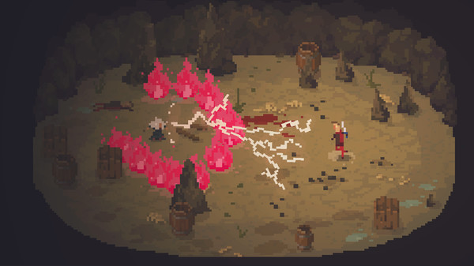

crawl

2. 小颗粒像素，总体依然色块化，但可以表达出层次感，颜色更加丰富，边缘强化弱。（）

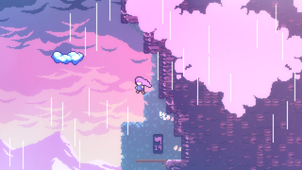

蔚蓝

3. 极小颗粒像素，更加偏向于动画风格，细节丰富，具有边缘和高光特性。

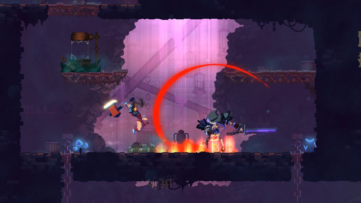

死亡细胞

---

### 艺术表现：
#### 颜色：
像素画除了形状，在颜色的利用和表达上，也可以做到极简。

Downwell
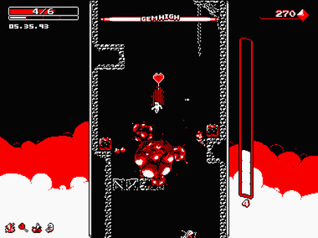

Downwell只使用了黑白与红三种颜色

The Lion's Song
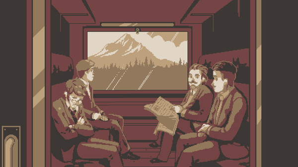

#### 维度： 
八方旅人让像素人物在三维模型的空间中进行移动，表现出精致的复古感。
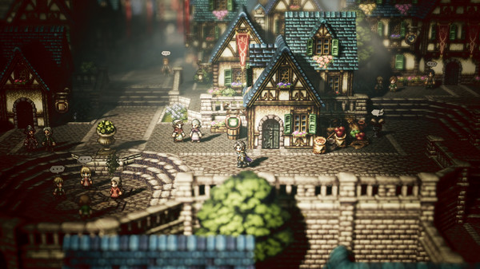

2D像素转变3D画面

一些完全3D的游戏，为了表现出复古的特质，也会将画面进行像素的风格化处理
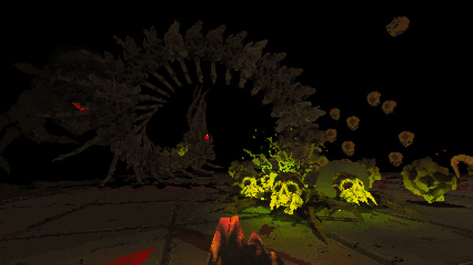

Devil Daggers的游戏画面更像是降低了屏幕的分辨率

3D模型构建的环境表现为2D像素
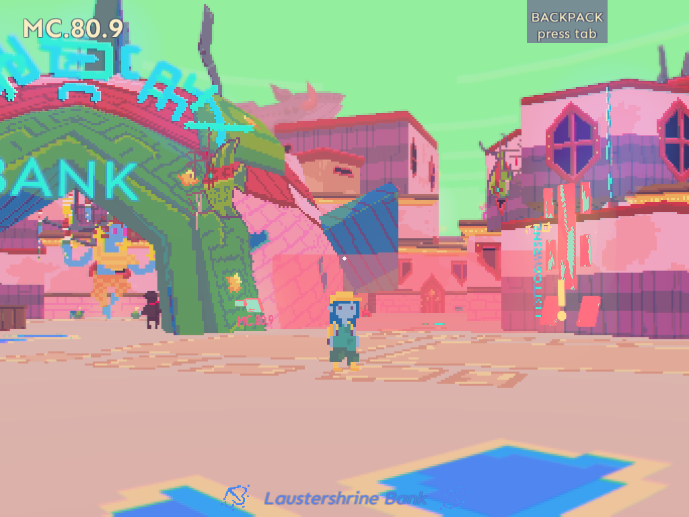

Diaries of a Spaceport Janitor

像素作为游戏主题的Fez却是一款3D游戏
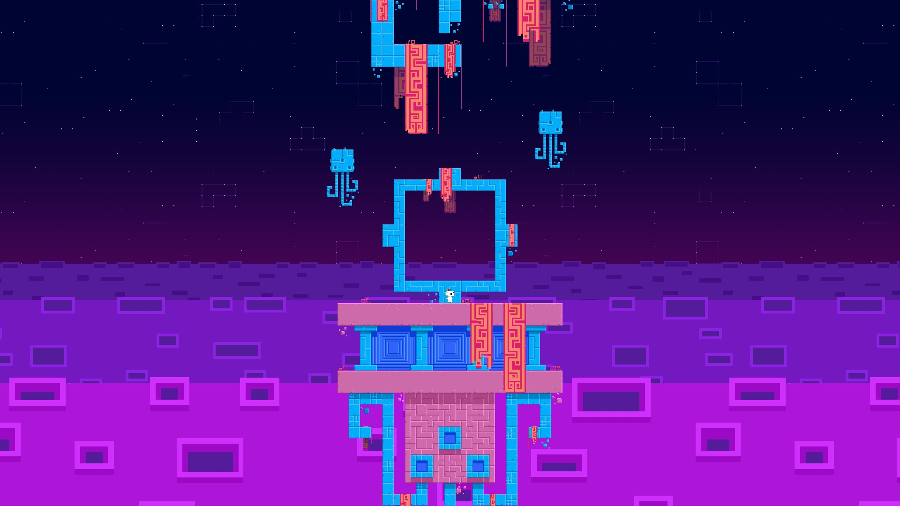

Fez

#### 风格化：
**The Hex**的画面整体观感更加类似于插画，但仔细观察的话，还是能看出像素的迹象，其实更像是放大图像后产生的锯齿。部分场景和游戏的设置界面具有明显的像素风格
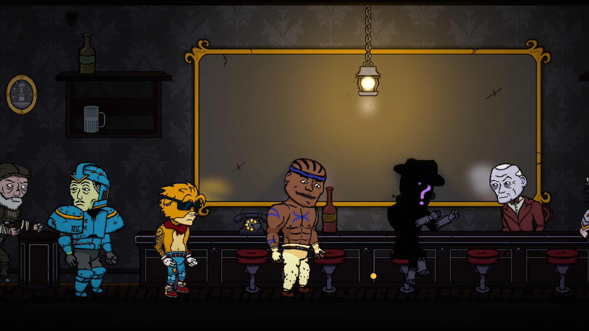

背景镜子中的画面非常细腻

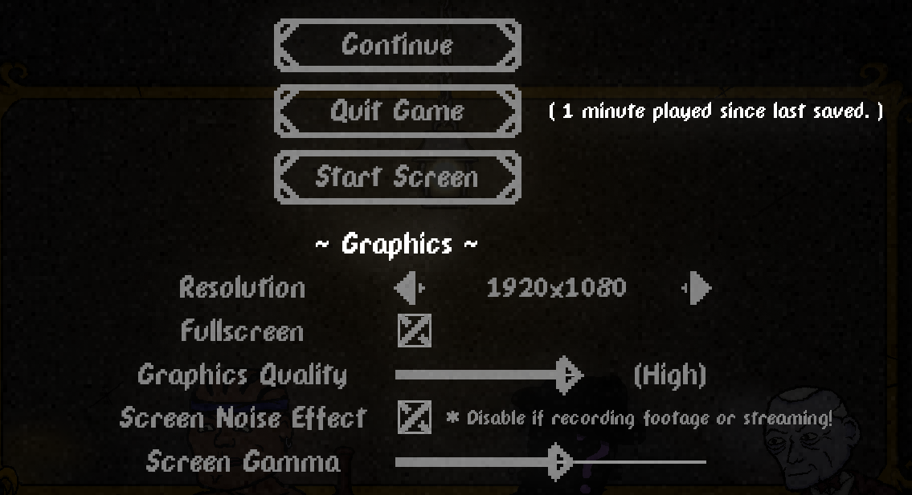

The Hex的设置界面

奥伯拉·丁的回归其独特的艺术风格并不符合像素的定义，但这种单色和点阵所表现出的复古概念与像素是一致的
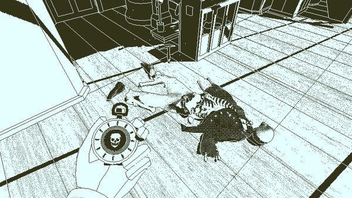

Return of the Obra Dinn

### 增强特性：
1. 特定的情况下，视觉上需要呈现复古效果，通常会在像素风格的基础上添加滤镜来模拟早期的显示器效果，比如添加扫描线(crt效果)，屏幕扭曲，通道分离等。
2. 在完成绘制像素场景中，可以额外给特定的人物或物品添加非纹素的特效，比如给火焰添加光晕。
3. ......

---

### 像素画的自动生成：
	一种代码实现思路：
	1. 提取边缘，(Sobel算子，Laplacian算子，Canny算子等)，设定合适的阈值，对提取的边缘图像进行处理，适当加粗，去除离散杂点，将边缘图转黑色保留。
	2. 对原图色调分离，设置色阶，降低像素颜色数量。
	3. 根据需求的像素大小，对原图进行适当比例缩放，同时等比例缩放边缘保留图。
	4. 混合处理后的图像与边缘图，按效果降低边缘图透明度。
	（存在的问题，具有杂点，颜色分离，色块较散，过渡不自然）

自动转化生成像素图网站：Pixel Art Converter  

<https://32comic.com/Pixel_Art_Converter/>

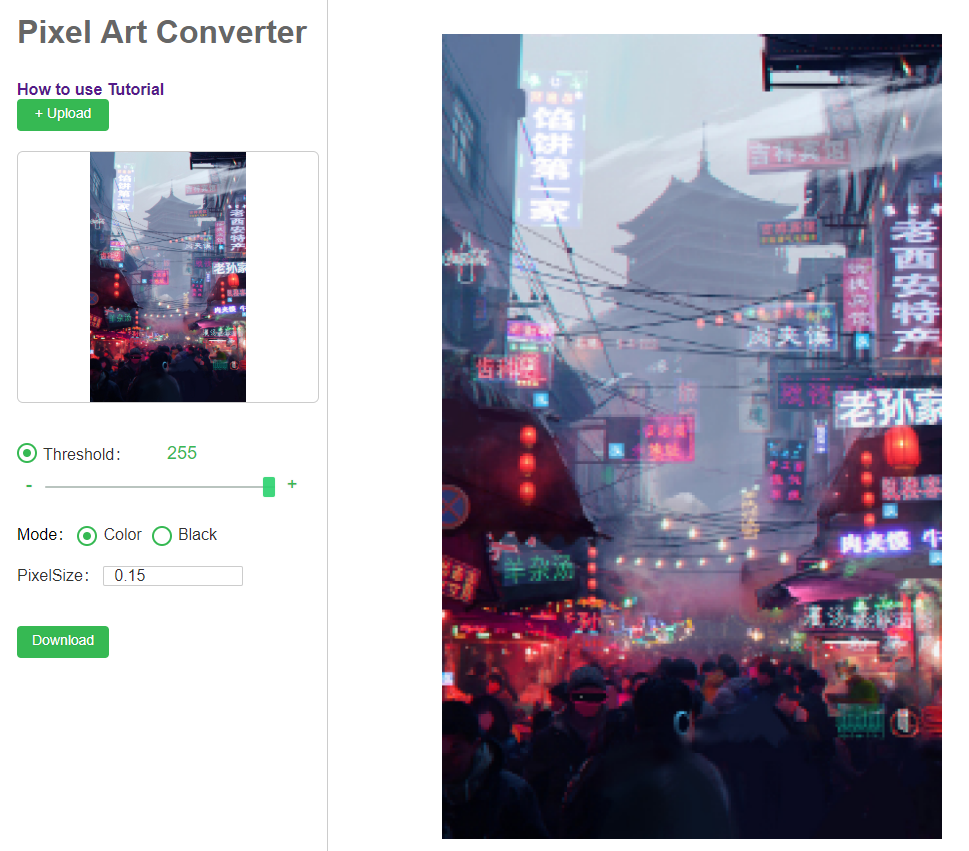

转换效果图

关于自动转换以及后期处理的教程：

<https://32comic.com/2018/11/09/超酷！像素画在线转换工具，1分钟快速画像素画/>

转换实现思路：
1. 对转换后的图片中的颜色数量进行降低
2. 调整像素比例
3. 清理杂点
4. 添加轮廓

在线像素绘制网站：

pixilart： <https://www.pixilart.com/draw>

LZ 8bit： <http://www.lizibuluo.com/8bit/>

实用绘制工具介绍：

<https://32pixel.com/wordpress/2017/11/24/5款可以替代photoshop的像素画软件/>

---

### 关于体素(Voxel)：
体素与像素在概念上同出一源的，在视觉的表达效果上也十分相似。
我的世界(Minecraft)毫无疑问是体素风格游戏中最为人所知的。  
一款2D游戏选择像素风格的原因通常是便于美术资源的开发或者表达特定的艺术风格，而一款3D游戏选择体素风格的原因也无外乎这两项。

这里并不继续探究体素在游戏中的表现，不过补充一个有趣的介于像素与体素的表达形式。

经典的桌面背景
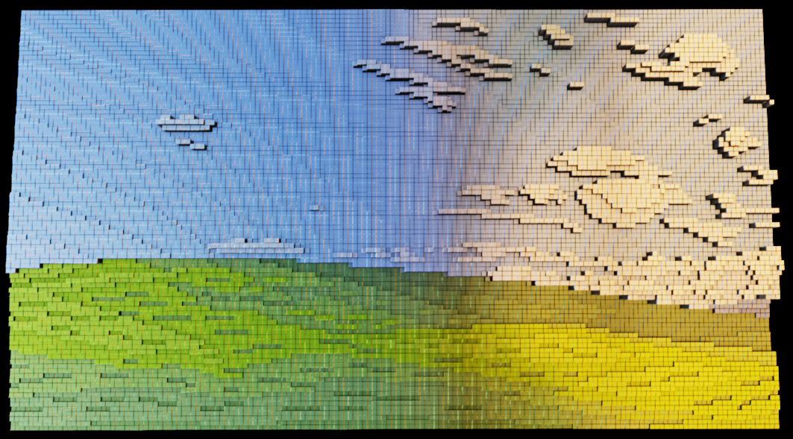

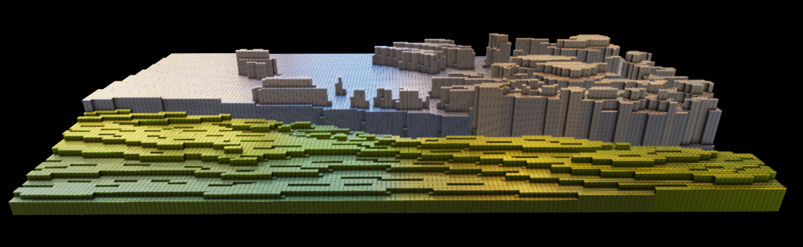

一幅插画
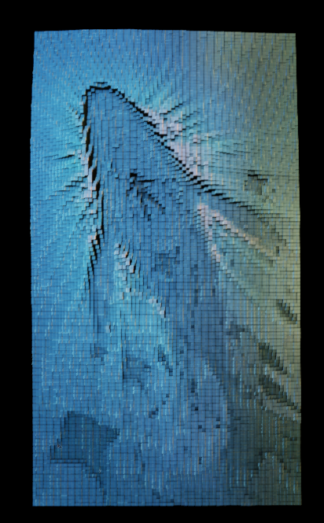

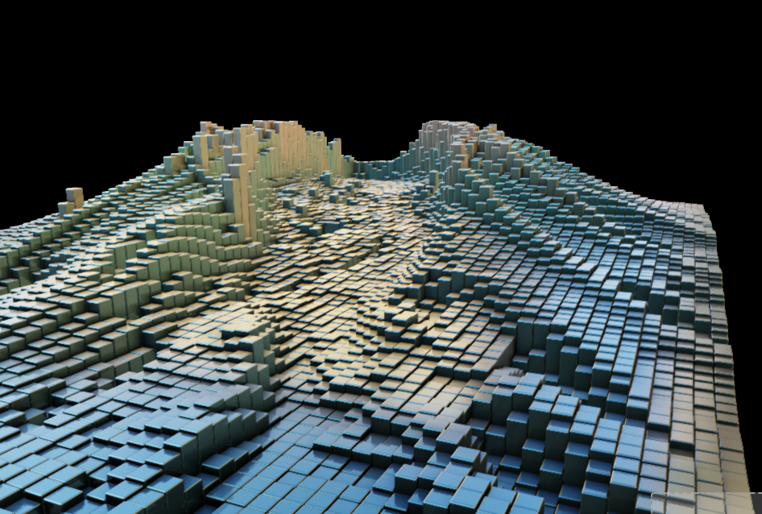

**这种画面表达形式，似乎是介于像素与体素之间。**

	图片生成来自于网页：
	<https://pissang.github.io/voxelize-image/>
	或
	<https://gallery.echartsjs.com/editor.html?c=xS1l7vPPwW>
	（由js编写实现）  
	可以上传本地图片查看效果

体素制作软件补充：Magicavoxel

相关网页：

<https://32pixel.com/wordpress/2018/06/11/magicavoxel%E6%96%B0%E4%BA%BA%E5%BF%AB%E9%80%9F%E4%B8%8A%E6%89%8B%E6%8C%87%E5%8D%97/>

<https://gameinstitute.qq.com/community/detail/118021>

---

### 一些想法：

* 通常来说，单个像素都是正方形。如果转换成其他多边形单位，如六边形或三角形，那么呈现效果有什么不同？
一些软件自带的滤镜已经由相关的效果了，就画面效果而言，就是一种正常的风格化处理。其实本质上，像素化就是图像的风格化处理。

* 俄罗斯方块在某种意义上，是否也可以算作像素游戏呢？

### 参考与拓展链接：

<https://32comic.com/2017/03/29/9%E4%B8%AA%E6%AD%A5%E9%AA%A4%E8%AF%A6%E7%BB%86%E8%A7%A3%E8%AF%BB%E5%83%8F%E7%B4%A0%E7%94%BB%E8%A7%92%E8%89%B2%E7%BB%98%E5%88%B6%E8%BF%87%E7%A8%8B/>

<http://fushigi-hako.site/2017/07/02/from_pixel_to_screen_1/>

<http://filthypants.blogspot.com/2015/04/more-crt-shaders.html>

<https://www.cnblogs.com/crazylights/p/3924952.html>

<https://www.cnblogs.com/simonxia/p/4481551.html>

<http://dy.163.com/v2/article/detail/E6N1FDRR0526K8VB.html>

