这篇博客的主题是关于Reborn的系统设计。

最近一直在完善和迭代Reborn的设计，虽然目前这个版本开发时间还比较短，许多设计的功能系统还没有具体实现，不过从目前的体验来讲，我认为它是具有潜力的。

### 关于Reborn

Reborn是一个事件驱动类型的模拟游戏，当然它还具有一些其他的类型特质，比如Roguelike和卡牌。

玩家在游戏中扮演的是一个全新的人类生命，游戏从角色的出生开始，以追寻到人生的理想而结束。  
Reborn要实现的一个核心目标就是其名称的含义，玩家并不是代入任何一个游戏角色之中玩一场游戏；而是玩家自己亲自进入游戏中，重新体验一切未知的经历，审视自我的存在。

目前代码量写了一万多行，预计各个系统完整实现的工程量在五万行左右。

---

### 游戏主要系统

#### 1. 事件系统

事件系统是游戏的核心系统，其他所有的系统基本上都是围绕这个系统进行拓展的。

**1.1 事件属性：**

先显示数据表中的事件

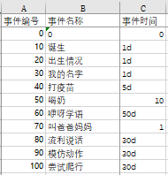

部分事件

如上图，所有的事件都是存储在Excel中的，可以实时修改和添加。  
生活中的任何一个事件，经过编辑数据之后，都可以加入到游戏之中。也就是说，整个游戏实质上是构建在现实生活之上的。

表中的每个事件具有不同的属性，也具有不同的出现条件，这一点在游戏中也是与现实生活想对应的。

例如：对于事件“打疫苗”

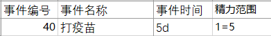

打疫苗

事件时间显示是5d，也就是5天（当然这个数据并不一定合理，仅用于初步测试），也就是说，玩家完成这个事件需要5天时间。  
右侧的精力范围是指这个事件每天可以执行多少时间。玩家可以任意调整分配在上面的时间，分配的越多，完成的越快，甚至玩家也可以分配超过表中的5数值的精力给这个事件，但这样会消耗额外的注意力，因此在这点上需要玩家来平衡自己的计划。

此外，事件还具有难度，发生地点，事件描述等等属性，这些属性会分别在游戏中的不同系统中发挥作用（这些系统接下来会进行说明）。
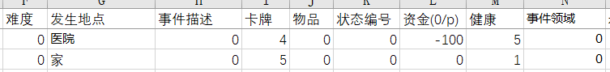

事件部分属性

目前一个事件的可定义属性共有**21**项，这21类属性基本上能够以某种分类的形式描述现实生活中存在的任何一个真实事件。

  

**1.2 事件条件：**

以上的事件属性介绍了事件执行产生的效果，而事件条件的作用则是定义一个事件该不该出现以及怎样出现。

例如，以下是部分事件的条件

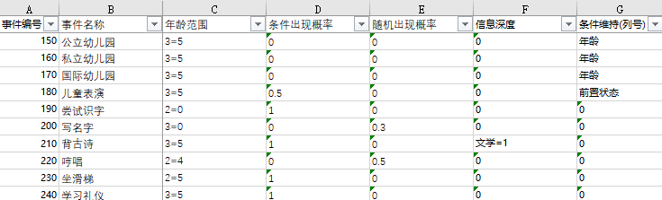

事件条件

年龄范围限制了事件出现的时间，两种类型的出现概率则是设定该事件的两种不同出现情况。  
信息深度是判断事件的可知性概率，对应在生活中，就像这样一种情况：有一个地方举办了一个抽奖活动，只不过因为宣传原因，有的人知道，有的人不知道，但是直到的人都可以去参加活动。  
条件维持，则是设定这个事件需要始终维持哪些条件，例如有的人即使上了小学（执行了这个事件），但是他要是一直逃课不完成学业，那么等他的年龄超过了限制，那么他就不能再继续上小学了（也就是说事件执行失败了）。  

其余的条件还有诸如性别，前置事件（必须已经完成某些事件），前置状态（必须具有某些状态），可否重复执行等等总共**22**个可定义的判定条件。

#### 2. 时间系统

时间系统同样是游戏的核心也是游戏极具有特色的一个设定。

在Reborn中，游戏中的时间与现实中的时间是同步的。现实中我们永远无法倒流或者暂停时间，而在Reborn中也是一样。

游戏进行的过程中，游戏的时间会按照一定的速度持续流动。人物角色的年龄也会不断的增长，更重要的是，需要在合适的时间选择做合适的或者想做的事，如果什么都不做的话，那么人生的大好时光就会白白浪费。

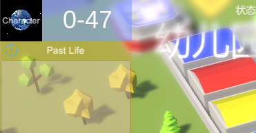

流动的时间

如上图，数字代表的是当前的年龄和天数。  
如果不是在如设置界面等特殊场景下，这个数字将不会停止跳动。

#### 3. 计划系统

计划系统是事件的主要生效途径。

当玩家在事件地点选择要执行的事件后，根据事件的分类，就可能被添加入计划面板中。  
随着游戏中时间的流逝，计划中的事件其进度也会不断的增长，直到完成，或者是暂停与放弃。

如下图，是两个正在生效中的计划。

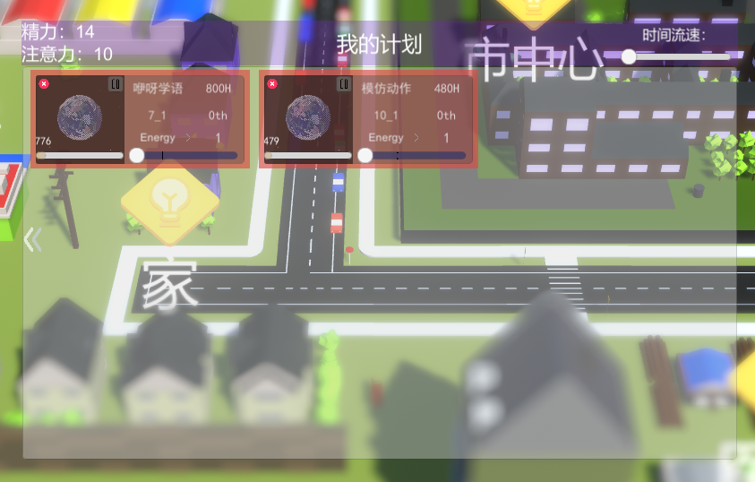

进行中的计划

在计划面板中，玩家可以通过滑动条，调整和分配给不同的事件不同的精力大小。

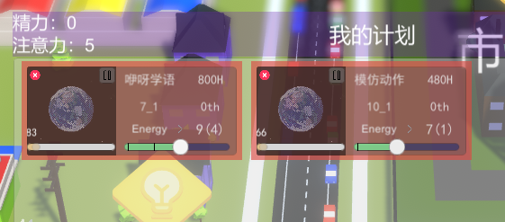

调整计划分配精力

如图，“咿呀学语”消耗了9点精力和4点注意力；模仿动作消耗了7点精力和1点注意力。当前计划中的剩余精力为0点，剩余注意力为5点。  
另外可以看到，咿呀学语的总共所需完成时间是800小时，在当前分配精力为9点的情况下，除去以完成的进度，还需要83天才能完成该事件。

不同的计划具有优先级，玩家可以任意在计划面板中调整，优先级高的事件将会优先执行。

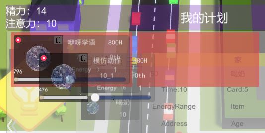

计划优先级

拖动事件计划到前方的计划框中，位置和优先级就会进行交换。

当然，有一些事件是不会被加入进计划之中的，它们可能是瞬间就能完成的事件，也可能是一些生命无常而随机遇到的事件。

事件一旦完成之后，就会获得相应的反馈，可能是奖励，也可能是一些其他东西。同时，这个事件会添加进入角色的人物经历之中。

#### 4. 知识领域系统

知识领域系统仍然是以事件系统为核心进行构建的。

通过分类划分，定义了上百个不同的知识领域极其子领域
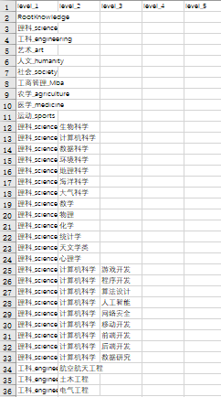

知识领域

每局游戏，角色的所有初始知识都为0。  
同时，每一个不同的事件，都具有一定的知识领域。例如，执行看文学小说这个事件就会增加角色部分文学领域相关的知识。有些事件还有可能是复合的，也就是说能够增加多个领域的知识。  
一般来说，一个事件的执行时间越久，那么其增加的对应知识也越多。

知识领域的一个重要特色是关联性，意思是不同的知识之间彼此是相互关联的。比如说，玩家的游戏开发知识增加2点，那么其父领域计算机科学的知识也会增加0.2点（比例设定一般为0.1），与此同时，计算机科学的父领域，理科领域还会增加0.02点。最后，由于父领域的知识是会同步增加在各个子领域中的，所有计算机科学下除游戏开发的其他所有子领域都会增加0.2点，而所有理科领域下除计算机科学的子领域的知识都会增加0.02点。

说到这里，还没有解释知识到底有什么作用。

**知识的作用有三方面：**

* 第一个与事件条件中的信息深度相关联。  
前面说过，信息深度决定了事件的可知性大小，这意味着，有些信息深度值很高的事件（例如，参与火箭的制造和发射），即使角色的属性满足该事件条件，但是由于相关的知识不足，这个事件有极大的概率是不会出现在玩家的可选项中的（有极小的概率存在是因为现实世界确实存在运气的设定）。而角色的相关知识越多（如理科知识，航空航天知识），那么这个事件也就越容易出现。

* 第二个作用是与事件的难度相关联。  
众所周知，现实中形形色色的不同事件，都具有不同的难度，例如学习就比玩游戏难多了，所以游戏中存在事件难度的设定。另外一方面，现实中也存在这样的人，他天生就觉得学习很简单。所以为了体现这种情况，在游戏一个事件的综合难度是由该事件的基础难度设定以及该事件的未知知识点所叠加计算的。如果玩家的知识不满足这个事件的基础要求，仍然选择执行的话，那么相差的知识点就会叠加在该事件的难度上。  
而难度当然是具有作用的，一个事件的难度越高，那么就越有可能在执行事件的时候出现问题或困难，如果不解决这些困难的话，那么事件的进度将不会增加，也就代表着分配在该事件上的精力被浪费。  
出现的问题或困难的具象表现形式是某种随机的，简单直接的交互或小游戏。  
从游戏设计层面来讲，难度除了作为拟真之外，另一个作用是使得玩家在计划分配完成之后，出现的问题和困难作为一种目标，让玩家可以继续执行和操作。当然，解决问题困难之后也会对应给予玩家其他系统中的一些小奖励。

*可能会出现如下图类似的图标，表示这个地点的事件在执行的时候遇到了某些问题或困难。*
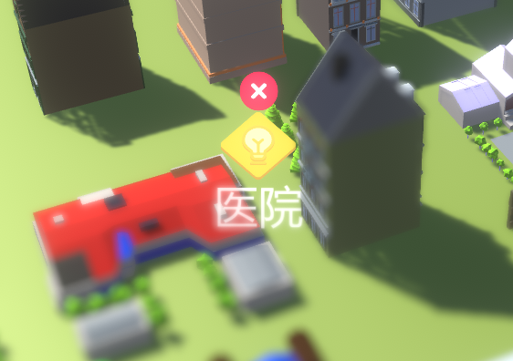

出现困难或问题

* 知识的第三个作用，体现在游戏的最终目的上。  
前面说过，游戏的结束标志是玩家寻找到最终的目标，也就是理想的职业工作。  
在最后的判定中，玩家可以选择自己愿意为之奉献一生的工作，如果角色的知识满足该工作所要求的话，那么本局游戏即以好结局结束。  
同大部分的Roguelike一样，Reborn在设计之初就是需要具有可反复游玩的游戏性。在下一局游戏中，玩家体验到的将是另外的人生经历。  

#### 5. 挑战系统

如何体现人生中的一些重大挑战呢？比如高考，这肯定不能仅仅用一个事件来简单的衡量。

目前Reborn的做法是单独以另一种游戏的形式进行挑战。

需要补充的一点事，游戏中所有完成的事件，其反馈的奖励基本上都会包含一张以该事件命名的卡牌，不同的卡牌具有不同的数值（一般来说事件的标识的时间越多，卡牌数值也越大），也可能具有一定的效果。  
从主题的意义上，这些卡牌代表了人物角色所具有的知识，技能和经历。  
而从玩法的角度，这些卡牌将会是玩家在挑战系统中挑战的资本。

以高考为例，当角色执行高中事件完成时，将会触发高考挑战。此时，游戏会转换到另一个场景中进行另一种游戏，之前设计的Card GO（试玩链接：<https://vrceus.github.io/Card-GO-Demo>）就是这类游戏挑战之一。

CardGO

目前还有另一个挑战游戏初步设计完成，等待开发中（策略及节奏类游戏）

玩家在挑战游戏中的最终表现，即该事件挑战的最终表现。如果玩家在挑战游戏中的分数越高，则意味着在高考中获得的分数越高。

#### 6. 场景系统(游戏美术形式表现)

游戏的美术初步设定为3D表现，低面体或动画渲染风格。目前为带有移轴效果的低面体风格。  
主要场景为城市加部分自然，视角为倾斜的俯视视角。

地图上会显示社交关系中存在的人物，玩家可以点击进行交互。  
地图上会随机出现一些可以交互的事件和物品，需要玩家通过观察去发现。  
（例如马路上玩家可以点击交互扶老人过路；角落中会出现随机的小道具，点击后可以获得等）  

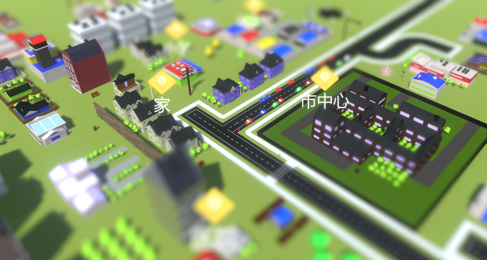

游戏场景

*游戏中的地图可移动，旋转和缩放*

---

### 其他已经设计还未开发的系统简述

#### 1. 游戏内部事件编辑器：

实现可视化的事件编辑，让任何一个玩家都可以定义创造自己所经历过的难忘事件并加入游戏之中。
 
由于项目构建的时候各个事件就是模块化的设计，并且使用excel存储的事件数据。所以这个功能主要工作是代码和UI的实现，实现可视化编辑，逻辑层面上没有什么难点。

这个游戏的一个核心是需要大量的事件数据，希望这样能充分利用发挥UGC的力量。  
玩家也可以定义一些特定的人物经历路线，然后进行体验。  
最后，开发测试的时候，也可以不用在外部改表了。  

#### 2. 社交系统

通过社交网络，展示与主角具有联系的其他人物角色，包括亲属，朋友与恋人。  
亲属具有满意度设定，朋友具有好感度设定，恋人具有甜蜜度设定。

#### 3. 任务系统

社交关系中的人物可能会发布一些特定的任务，当玩家满足条件之后，可以获得额外的奖励。  
任务一般为执行或完成指定的事件，或者获得和交付指定道具相关。  
（某种意义上，任务系统是在引导或者说限制玩家的自由选择，这与现实也是具有联系的，父母总是期望子女做某些事情而不要做另一些事情）  

#### 4. 道具/经济系统：

完成部分事件后会直接奖励道具或者金钱。

道具的功能有：  
改变角色的某些属性，
出售，理财，社交，赠送和分享，
触发部分事件或完成事件所需。

道具的获取途径：执行特定事件，使用资金购买。

#### 5. 其他

---

### 写在最后

从自己最开始想做一款关于人生与经历的游戏，到目前的Reborn这个设计版本，前后迭代了有很多次。到现在为止，虽然从过往的游戏经历来看，认为目前设计的玩法系统已经基本完善成型了，但是我还是没办法保证它不需要再次迭代。

目前游戏有一些问题，是我发觉到了的，例如代入感的营造，虽然已经有了大体的解决方法，但是想必还有许多的问题是我没有发觉到的，就无从谈起解决。

设计一款创新的，好玩，以及我认为需要具有意义的游戏，毫无疑问需要大量的思考。推翻，改进，推翻，改进，再推翻，再改进。有时候甚至认为这个过程没有终点。其实这样也好，至少自己永远有做出更好的游戏的目标。

为了尽可能的拟真，随着后期各项功能系统以及游戏数据的增多，Reborn目前仅仅是一个事件就有四十多项数据定义。  
虽然数据越来越多，但是Reborn从来都是一个以体验导向的游戏而非以数值导向。Reborn会最大化的简化无意义的数值表现，所有的游戏数据都是希望给玩家带来更好的关于人生的某种体验，而不是让玩家投入自己真实的时间去追求那些毫无意义的数值。

我们的生命中没有那么多的数据，我们并不确切知道自己的智商和情商是多少，体力和魅力又是多少，我们追求的也并不是这些虚拟的数值的提升。  
值得体验和追求的只有每一个真实的事件与经历。  
这就是我希望Reborn所能做到的和带来的。  

从某个角度来讲，选择做一件事，就像是播下一个种子，需要替它浇水，除草，施肥。然后就是等待，等待它成熟的那一刻，就能够收获这件事给我们带来的东西，是一段经历，也是一个故事。

