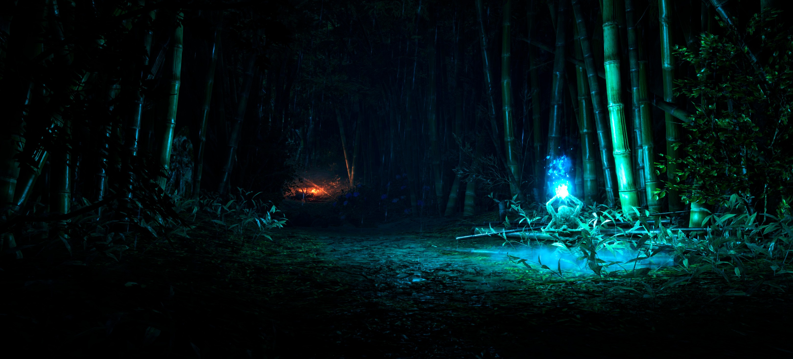
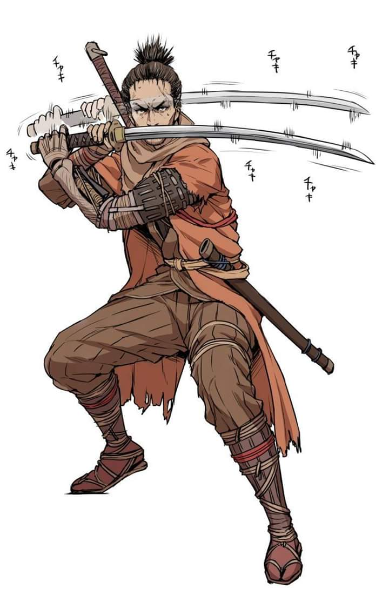

## 只狼-铁与血的交鸣

### 40h+

### 9.5/10

一周目佛珠，种子，结局条件全收集完成。  
全精英，全Boss击杀完成。

某种意义上，只狼高绝的难度并不是来自于掌握技巧的繁复，而是来自于缺乏对敌人的了解。

战斗作为只狼最核心的要素，表现出了令人惊艳的效果。  
仅仅是挥刀与格挡，这两个简单的操作就呈现了及其刺激的战斗体验，以至于一些玩家将它称作为一款音游，确实有其道理，两者的相似性玩过的人自然是能够体会——挑战一个Boss，就像挑战一首高难度的歌。节奏快，变化多，需要反应，但更需要背板。

---

### 战斗系统：

作为只狼的核心，这方面有许多文章都对其进行了详致的分析，我觉得也不需要自己在这方面写太多文章，仅简要概括。

只狼之于黑魂，虽然增加了技能树，可没有能替代平砍输出的技能；虽然取消了精力条，可也没有想象中的无限连击。

* 攻击：简单的挥刀，朴实有效

* 格挡：
	如果战斗系统的设计是只狼的精华，那么格挡的设计则是战斗系统的精华。所谓精华中的精华，简单，直接，效果卓群。  
	格挡同时给予了敌人防御的设定，这种理所应当的行为却没有在许多游戏中体现，但在只狼中，无论是敌人还是主角身上，都体现的十分漂亮。  

	（不过或许其依然存在一点瑕疵，这体现在玩家所谓抖刀术的出现。它确实地破坏了战斗的优雅。这种累赘的操作却自然而然的出现在玩家的游戏过程中，设计者没有对其进行处理或限制实在遗憾-也许他们认为架刀防御消除架势的行为本身就能够限制抖动。这在角色具备一定架势槽时的确成立，但是在角色不需要没有架势无需消除的时候就会失效（多周目交出护符，非完美格挡掉血也能进行限制）。  
	一个解决想法是，每次点击触发格挡的一个时间片内如果没有受到敌人的进攻，那么这个格挡行为会单独将自身的架势槽略微提升）

格挡防御

* 垫步(闪避)  
	识破（特殊的闪避，(有风险)高回报）
* 跳跃  
	雷反（特殊的跳跃，(有风险)高回报）
* 勾绳（快速拉近战斗距离）

跳跃与勾绳两者既是位移系统的一部分，也在战斗系统中发挥作用。很好的体现了设计复用的理念

* 状态Buff与忍具：  
	特殊敌人有奇效的情形，在游戏中全都有过详细的提示说明。

* 血条与架势槽：  
	脆弱的血条意味着极低的容错率，同时也代表着，要战胜敌人，就必须掌握敌人几乎所有的战斗节奏。这显然是一种强迫玩家学习的设计，但也因此，玩家才能感受到自身巨大的成长，并为之而欣喜。

	架势槽应该是只狼中最具创新的设计。在设定上，它调和了暗杀与正面战斗两种方式在印象上的冲突。在战斗系统中，它成功的强化了格挡操作的价值，完美格挡成功不仅是一种对自身的防御，同时更是对敌人的进攻和削弱。

	（在大多数游戏之中，防御行为是憋屈的，只有进攻才是帅气的。但是只狼将玩家脑海中的这种固定印象颠倒了过来，告诉玩家防御才是王道。  
	除了架势槽的设计之外，另一个有力地对防御行为的强化体现在视觉上，完美格挡能产生耀眼的火花与清脆的打铁声。而成功的攻击呢，没有任何的特效，只有一个普通的砍中音效）

---

### 忍具与技能

忍具系统和技能系统本质上可以归作一个系统。
设计目的一方面是提高游戏玩法层面的多样性，降低部分关卡的难度（如不同忍具对不同敌人有特效），另一方面是让玩家杀死普通敌人所获取的经验和金钱奖励变得有价值（用不出去的钱是没有价值的）。

忍具实质上是加强的技能，而纸人的携带数量则限制了这些强力技能的使用次数，防止只狼精心设计的战斗系统被玩家打破。
技能系统的设计上，主动技能只能携带使用一个，部分强力的技能依然有纸人消耗限制。至于那些没什么用的技能，其存在的意义实质上主要是消耗掉角色的技能点（从而让经验这种资源变得更加有价值）。

之所以要把忍具与技能拆分成两个系统，也许最大的原因在于只狼武器与防具装备系统的缺失，因此需要忍具系统来替代，其次忍具系统还作为金钱的主要消耗途径。

传统带有RPG的游戏都含有装备系统，只狼在这一方面做了简化（为了满足战斗系统的设计以及剧情需要），整个游戏流程玩家只有一(两)把刀，没有其他武器，更没有防具。攻击的提升依靠击杀BOSS获得的战斗记忆，防御（血量）的提升依赖于击杀精英敌人以及探索环境所获得的佛珠。这两者变相取代了战斗中装备存在的意义。

但是装备系统不仅是用来满足游戏的战斗系统的，另外一方面，它更多的是提供给玩家成长与收集的反馈奖励。

无论是历经辛苦成功击杀BOSS，还是让随处可见的敌人倒下一个，在这个过程中玩家都进行了付出，因此必定是渴望奖励的。  
只狼对前者的奖励主要是佛珠，技能与战斗记忆；后者是金钱，经验，消耗品与升级素材。  
金钱，经验是每个敌人都会掉落的，并且数量总是一致的，两者作为必要存在的基础奖励，不过玩家依然会缺少获取到它们的期待感。大部分游戏为了解决这个问题此时会让敌人有一定概率掉落装备或者制作装备的素材，但是只狼中并不存在装备的说法，于是忍具系统有了存在的必要性。

忍具除了战斗，也为了消费

另外补充，金钱在只狼中的主要消耗途径有两个，一个是上述的忍具升级（包括特殊忍具素材的购买），另一个是商人处购买消耗品（如各种糖，神之飞雪或纸人等）。  
（面具碎片，佛珠，葫芦种子和特殊忍具素材等严格上都不能算作消耗品，因为它们一旦生效，对于角色的效果是永久保留的）

玩家在前期金钱并不充裕的时候，是几乎不会去购买消耗品的，而会更乐意储存金钱去购买或升级那些具有永久效果的东西。  
当然，这受到游戏设计上敌人掉落或探索收集的消耗品已经足够的影响，因此无需购买，但是这绝非主要原因。因为即使设计为玩家所持有的消耗品不足，一般的玩家依然还是会选择这样去做。

这里想要说明的是，玩家更喜欢（把资源花费在）永久保留的东西，而不是暂时拥有。  
因此假如金钱的花费途径只有购买消耗品这一种，着实不是一个好的设计。更糟糕的情况是，玩家拥有的金钱将会远远多于购买消耗品的花费，大量的金钱将花不出去而变得无用（这种情况通常出现在一款游戏的大后期），那么消灭敌人奖励金钱的设计就会毫无意义。  
那为什么不把消耗品的价格调高呢？好吧，这是个更糟糕的主意—辛苦杀敌一小时，然后只能买个消耗品用一分钟（爽不爽还要另说）？  
那就设计为生效一小时。可这样的话，游戏为什么还要设计金钱或者消耗品这种东西呢，直接生效就好。

---

### 场景关卡地图：

* 色彩：

	比起黑暗之魂，战国背景的只狼呈现了更加风格繁多与赏心悦目的地图风景。更具体就涉及到游戏的美术和画面相关。

仙峰寺意境

* 复用：

	提高资源的复用率对开发者而言是一个喜欢的做法，既节省了开发资源，玩家大部分情况也愿意接受。

	不过只狼部分资源的复用率还是太高了。苇名城重复利用了三次，虽然整个城市是一个设计精巧的立体空间地图，值得四处探索，作为游戏的地图中心发生的事情比较多也可以接受。但是还要玩家来回重复探索3次，三次都要再去点燃鬼佛真的是让人有点烦恼。

	（另外，狮子猿和破戒僧的重复利用我认为都挺不错，因为的确具有变化与特色。但是许多孤影众和小兵就是没有特点的复制了，基本只有数据的变化）

* 空间：

	如上所述，苇名城高低错落的楼阁，让整个地图的丰富度比起常规的平面地图或许扩大一倍。在悬崖峭壁与苍虬古木之间跳跃穿梭也完全符合了玩家作为一个忍者的想象。此外，水下空间的探索同样没有缺少。

立体的苇名城

* 连接：

	除了少数的关卡地图（源之宫，平田宅邸，幻廊等），只狼的主要地图是全连接的，玩家可以不借助鬼佛就能后移动到任意的场景地点。虽然大部分时候玩家是利用鬼佛进行快速移动，而无法体验到这种设计带来的体验上的完整感。但是在初次探索地图，进行开荒点燃鬼佛的时候，无缝地图的带来流畅感体验非常好。

* 鬼佛（传送与存取）：

	鬼佛的分布距离与分布位置都很合理。为高紧张且快节奏的游戏过程提供了及时的休憩点，一是让玩家得以放松，二是获取资源。  
	此外，所有的BOSS附近的鬼佛点距离战场的距离都较近，也基本没有小兵进行阻碍。  
	能够快速送死的贴心设计真是太好了！

让人安心的鬼佛

---

### 潜行与暗杀

潜行与暗杀本身的乐趣不弱于正面战斗产生的快感。

设计目的一方面突出了忍者的特性，另一方面，有效的降低了部分关卡的难度（有些关卡甚至于必须要进行暗杀或忍杀才能通过，否则多打一的难度非常之大）。最后，它提供了不同于正面战斗的奖励反馈机制。  

* 	暗杀：
	暗杀没有打铁那么刺激，但是比打铁的收益高很多（大概没有人刷经验是直接上去打的）。忍杀技能的强大效果进一步增强了暗杀的重要性。

	暗杀快速获取收益的奖励反馈与正面战胜困难敌人的成就反馈是不同的。只狼很好的将这两种对玩家的不同反馈都进行了表达。  
	人的需求的复杂多样的，既喜欢天上掉馅饼的快乐，也喜欢拯救世界的快乐，能同时获得两种快乐总是更好的。

偷偷到背后

* 	潜行：
	潜行基本上是为暗杀进行服务的，几乎没有潜行而不暗杀那么一两个敌人的关卡，毕竟，如果只是为了潜行通过关卡，那么为什么不跑酷呢，还快！（唯一就是不符合忍者的设定了吧）  
	在系统设计上总体没有什么问题，只是吃糖隐身这一点设定我觉得有一点违和，哪怕给义手忍具多加一个隐身衣设定上也好一点吧？

忍者的基本技能

---

### 回生与冥助：

* 冥助：

	死亡会掉落物品的惩罚是魂类游戏的一贯传统，核心的目的还是为了让玩家产生强烈的情绪波动，具有丰富的游戏情绪体验。

	只狼中的冥助在游戏的过程中，有些时候的确能发挥一些作用，但是客观上显示的30%几率，以及仅仅是对于经验和金钱的保护作用，怎么都会让人觉得这个设计有些鸡肋。经验会自动转化技能点以及钱袋的设计都是在变相的削弱冥助的重要性，数量充足的龙胤滴露也近乎完全抵消了死亡带来概率降低的惩罚。

	删除这个设计，似乎玩家的游戏过程也不会发生什么变化。因此冥助这个设定更多是为剧情服务的，而实质的功能意义很弱。（另外一个用处也许是附带增加了龙胤滴露这样的可收集要素-只狼中的要素收集感较弱）

* 回生：

	每次休息，角色都拥有固定一次保底复活机会。  
	显然，这个复活机会是给予玩家享受回生系统好处的。

	敌人的每一条血只能复活一次，主要是限制玩家正常情况下最多只能复活两次（不吃药），同时也防止玩家一时冲动就在敌人第一条血时消耗所有复活机会的滥用。
	在较高可能胜利的情况下，才给予玩家第二次复活机会。

	需要累积才能拥有的额外两次复活机会彼此形成一定的循环。基本保证在使用掉一次后，另一个使用时，前一个也接近充能完成，保证与BOSS对战的续航。
	（不过依然有概率遇到这样的情况，两次额外复活机会都被消耗，只有保底的那一次。为了保证更高的胜率，玩家有些时候可能会选择暂时中断连续挑战BOSS的节奏，而到别处去刷小兵充能好复活次数再回来挑战BOSS）

	复活半血与复活满血的区别
	半血更接近死亡复活后的真实状态
	玩家死亡复活后，大部分的敌人被设计给玩家预留喝药的时间。（毕竟任何一个敌人都可能秒杀半血的角色，玩家刚复活就被打死显然是不该出现的设计）
	其实这种设计下，复活直接满血和复活半血再喝药没什么区别（唯一不同是玩家会多消耗一次喝药次数）。也许可以进行差异性的设计，保底的那次复活满血，而第二次复活半血。这样或许能更加鼓励玩家使用第一次复活，而对第二次复活机会的使用做出更慎重的判断。

	回生系统与加长的血条两者之间有什么区别？
	如果是玩家的巨大失误，那么死亡的那一刻，减轻了这次巨大失误的惩罚，可以复活再来。（在低血线失误的情况下，即便加上复活的额外半条血，可能也不够抵消敌人的伤害）

	复活机制减少了玩家因不可控因素死亡时的惩罚。
	在探索上，意味着可以有更多恶趣味的关卡，以更多奇怪的方式杀死玩家。而玩家复活后选择回到鬼佛处或直接通过关卡，也不会惩罚。
	另外，它有效的区分开了因不同原因导致角色死亡而受到的惩罚的不同。
	如果是关卡设计或是玩家细小的操作失误等客观或主观不可控原因导致角色死亡，那么理应不该给予玩家严重的惩罚。此时复活机制发挥效果。
	如果是玩家判断失误或者接连不断的操作失误等主观因素原因导致角色死亡，那么确实应该给予惩罚。这生效于玩家第二次的真正死亡。

	最后一点是剧情意义上的，回生系统解释清楚了大部分游戏无法解释的为什么主角死亡了然后怎么就又能突然复活了的游戏设定。

回生解释了为什么主角可以不断复活

---

### 探索：

整体上满足了玩家的探索愿望，比如有隐藏的墙壁暗道，水下的敌人与宝物，细心才能发觉到的小径或者入口等等。  
不过在探索上有一点对我而言体验上可以更加优化。

玩家探索的目的同时也是设计者鼓励玩家进行探索的手段，一般来说有两个，一是了解故事背景剧情，二是获取隐藏的惊喜奖励。

只狼的支线数量和丰富度显然不够，对于世界背景和人物的补充和刻画也因此显得不足。当然，这主要还是限于游戏本身体量的原因，无法苛责，未来是否会有只狼2也未可知。

不过在奖励上，我认为可能的确对部分玩家存在设计上的小问题。主要在于只狼所有场景中所有分布的奖励标记都是同一个样子-发光的袋子（魂系列的设计也是如此）。

许多时候，我绕过曲折的地图，终于来到发光袋子前面，满怀期待以为是什么好东西，结果捡起来只是一个普通的药丸，此时的失望之情可谓非常了。
将不同等级的收集品奖励在地图上以不同的大小，颜色和光芒的袋子呈现，我认为会是更合理的设计。这种设计下，在拾取之前，我会仍然不知道具体的奖励是什么，从而保留惊喜感。看见了巨大且光芒四射的袋子，我会更加惊喜；看见了小袋子，就有了心理预期，拾取后至少不会失望。

### 其他优点：

* 美术画面：

	画质虽然确实达不到一些3A的水准，不过考虑到游戏本身PC上才13G，已经满足。设计或者还原方面了解不多，不过怪物和建筑基本都各有特色（第一次宣传视频看到白蛇神的时候感觉很刺激紧张，实际的演出效果也确实不错-战神耶梦加得乱入）。  
	仙峰寺的山峰古刹，源之宫的楼台阁榭和落英缤纷等，都展现了独特的意境。

源之宫

* 音乐音效：

	打铁的声音极其清脆悦耳。音乐上虽然没有什么令人印象深刻之处，但是也没有使人感到尴尬违和。

* 加载和优化：

	加载速度比较满意。由于电脑存储空间不够，我是下载在移动硬盘上通过USB连接电脑玩的，鬼佛传送时地图的加载速度还是挺快的。

* 剧情：

	就算游戏本身呈现的不够好，还有狼学家们的考究文章。
	不过说实话，有些剧情设定我感到还是很迷，只是任务需要，那就去完成任务，并不觉得特别自然，不知道该去哪里做什么事的情况还是会偶尔出现。

无解的剧情杀

* 灵活度：

	没有精力条或者CD的限制，随时随地的奔跑，跳跃与钩绳位移。还有广阔的水下世界，可以自由的游泳与潜水。  
	在关卡地图配合下的呈现，让角色真正成为了一个忍者。  
	跑路的乐趣比起黑魂着实高了不少。

### 可能存在的不足：

* 多周目的可玩性低：

	白金必须要多周目，但游戏的多周目可玩性很弱。不同周目的变化很少，只有结局，难度，以及源之琉璃这一种收集元素。

	结局方面，游戏设置了四个结局，也就是说，按照标准的官方流程，需要通过四周目。

	收集方面，义手升级需要的源之琉璃一周目最大获得数量是六个，总共需要10个，默认需要进行二周目。

	难度方面，二周目可以上交护符，对玩法具有一定影响。每周目敌人难度会有变化，但是角色实力也会提升，可以变相抵消。（钟鬼任意时刻都能触发）

	除此之外，所有的游戏玩法和要素都可以在一周目完全体验的。

	对应的问题因此而来，游戏在多周目设计上的多样性上没有太多提高，除了二周目的两阶段难度提升之外，基本没有新的玩法要素可以让玩家体验，但是结局和技能系统却在强制要求玩家进行多周目。

不通过SL，完成所有结局需要4周目

* 冗余的技能系统：

	技能系统可能存在的缺陷，必备的技能比如识破，追斩却需要玩家主动加点学习，但是玩家可能不会学习（而这两个官方甚至已经做了教学的标签）。

	同时另外一些技能的实用性很差，玩家基本不会使用，但却还是要在上面花费技能点。

* 不合理的经验曲线：

	只狼的系统设计对一般玩家而言最多就只能满足二周目，但是它却设计了4个结局。更不合理的是，还设计了一个正常4周目时间都刷不够技能点的经验曲线。

	游戏白金需要刷大量经验来获取技能点，但是从官方对于只狼的玩法设计上来看，只狼本身是一个快节奏的游戏，它并不鼓励玩家进行刷怪的行为（有时金钱，经验与材料的需求使得玩家在某些时候不得不去这样做。虽然由于暗杀的设计，刷怪的过程相对一般游戏来说会更加快速方便一些）  

	可能的唯一安慰是，官方为这种令人费解的游戏设计又提供了简单粗暴的解决方案-那就是虎口阶梯的关卡设计。设计者无论是有意还是无意，总之在这里创造了一个完美的暗杀路线，为玩家刷经验，金钱和材料提供了良好且快速的环境。  
	（之所以说是官方可能的有意设计，是因为虎口阶梯同时也是只狼中少见的支线NPC所处的位置之一，相比其他的地点，玩家是有很高的可能来到这里的，并且旁边钩绳过去就能看见一个可以暗杀的敌人，跳下去又能看见一个，往前走两步又是一个…实在太明显）

	不过这里我主要想说的是虎口阶梯五人组中最后的两个。这是两个会移动的敌人，但是特别的地方在于，每次刷新，两者的出现位置都是不同的。玩家可能需要砍两刀解决，也或许能直接暗杀完毕。总之，这一点细小的变化为重复单调的刷怪过程提供了少见与可贵的情绪波动，打破了无聊的平静。

* 主动技能容易误触发。

	右键接左键的指令虽然方便操作，但在正常与强大敌人对战的时候十分容易被误触发，然后往往就是屏幕浮现一个死字。  
	（挑战BOSS的许多时候，不得不把主动技能卸下。实际上，一般来说我自己是误触发被杀死一次后才能记起来去卸下技能，体验非常不好）

* 抖刀术：

	一些玩家戏称其法天下第一，不是没有道理的。  
	虽然我自己在游戏中也总是会使用，但我并不认为这是一个好的设计表现。

玩家技能-抖刀术

* 可收集要素太少

	只有没有收集成就感的消耗品与忍具素材，以及商店也卖的龙胤滴露。
	而一次体力强化被拆分成4个佛珠，变相的用数量来弥补丰富度的不足。  
	探索获取的物品标志提示可以在细节上优化，不同等级以不同形式展现。

* 视角

	在与巨大BOSS（怨恨之鬼）战斗时的视角有些难受，输出基本只能近身在它的脚边，因此是无法看见它手上动作的，许多时候因为不知道他的具体出招而被打死。  
	（遇见的最糟糕的情况是，我正在他的脚下输出，结果被它放的那个远程追踪火球给砸死了？虽然我更愿意相信这是一个设计上的bug，但视角上的问题也许的确可以优化）

### 总结：

游戏确实挺难。

---

##### （文章图片来自只狼官方和Steam玩家社区）