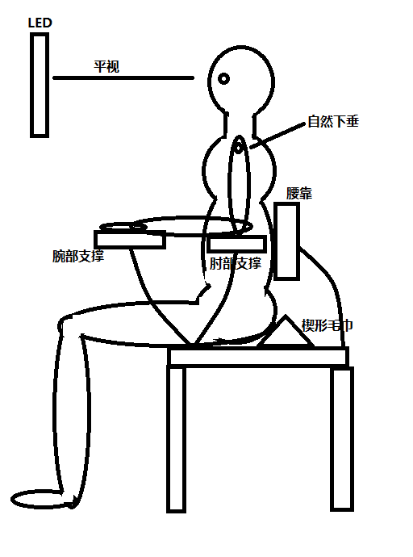

### 为什么要锻炼

我的目标是保持身体的健康。需要持之以恒的进行一些易完成的训练。

若想要维持肌肉的饱满度、充沛的体能和力量的巅峰状态，就需要频繁、不间断的运动。

来自 <https://www.zhihu.com/topic/19552192/top-answers> 

---

#### 锻炼流程

##### 深蹲-动作细节：
1. 双脚分开，脚跟之间的距离与肩同宽或者略髋于肩，根据个人肩宽腿长而定！
2. 脚尖外展，30°左右，依然根据自身结构而定，怎么舒服怎么来，但是接近90°那种肯定不合适！
3. 挺胸，收腹，腰背部挺直，保持正常姿势就可以，不要过挺！
4. 双手前平举或者胸前交叉！
5. 开始下蹲的时候，臀部先往后伸一下，这个时候躯干会伴随前倾，但是角度不应太大。然后开始屈髋屈膝，下蹲。
6. 下蹲过程中，躯干有控制的前倾，但应时刻标保持腰背部挺直，而且角度不应该太大。
7. 下蹲深度要求臀部明显低于膝关节
8. 膝关节运动方向应和脚尖朝向一致，脚尖分开多少，腿就应该叉开多少。
9. 重心放在足中或者足跟，膝关节可以微微超过脚尖。
10. 站起来不用说了，说一下呼吸，为了保持核心收紧，建议全程憋气，but，这么做对心血管风险有一点大，所以在徒手状态下下蹲吸气站起呼气也可！

中级：高脚杯深蹲  
高级：大负重深蹲，比如沙包
	
- 建议负荷安排：15次每组，4~6组，间歇1~2分钟

	
##### 剪蹲
1. 直立站好，双足并拢，脚尖也并拢。眼睛平视正前方就可以，当然微微向下瞅着地板也行，但是要保证不要过度低头，那样会导致躯干前倾。手臂的姿势可以参考上图。
2. 一只脚（咱们就假设它是左脚吧！）向正前方跨一大步，大约一条腿长的距离。右脚原地不动，脚尖向前。体重均匀分布于前后两腿。
3. 下蹲！
4. 下蹲过程中要保持骨盆中立位，不发生任何前倾、后倾、左右倾斜或者旋转之类不必要的动作。
5. 下蹲过程中要保持躯干竖直运动，不发生前倾、后倾、左右倾斜以及旋转之类的动作，而且不能有向前平移的运动出现。（这一点很重要，如果向前平移的话，那就不叫下蹲了，叫下滑，会对前侧膝关节造成很大压力，而且锻炼的效果也完全不一样了）
6. 在下蹲到底的时候，要求四个90°。躯干与左侧大腿成90°；左侧膝关节90°；右侧膝关节90°；右脚和地面90°。（第四点是个人完美主义追求和强迫症的产物，如果实在做不到也可以忽略）
7. 从正面观，左腿小腿垂直于地面，其走向沿着足尖方向，其实就是正前方。
8. 左腿膝关节不要超过脚尖
9. 右腿膝关节不要撞击地面。
10. 双腿同时发力蹬地站起，还原第2步姿态。
		
初期：跨步剪蹲  
中级：负重跨步剪蹲  
高级：保加利亚单腿蹲  
		

		
##### 俯卧撑
1. 身体呈一条直线，收腹，膝关节伸直，臀部夹紧
2. 双手分开的角度会影响到锻炼肌肉的侧重，比如双手与肩同宽，双肘紧贴肋骨运动的那种姿势对于肱三头肌的刺激就比较好。
3. 改变身体的角度可以刺激到胸大肌上中下不同肌纤维，比如把脚垫高那种，刺激上束会多一些
		

##### 仰卧划船（背部练习）
做法：
1. 找两个一样高的椅子，然后中间架一根墩布杆，然后你钻进去躺在下面。
2. 双手采用比肩宽一点的握距握住墩布杆，双脚踩地，身体背侧肌肉收缩，将身体挺成一条直线。
3. 背部和手臂发力，将身体拉起来贴近墩布杆，尽可能让胸部碰到它，保持片刻，慢慢放下。
4. 动作过程中身体仍然需要保持成一条直线的强直姿势。

- 在家锻炼背肌：
https://zh.wikihow.com/在家锻炼背肌
	
	
##### 腰腹部锻炼：
1. 仰卧卷腹
2. 仰卧起坐
3. 侧桥  
...

##### 训练安排方式：
1. 重复训练法，（初级）以上练习按照原有的顺序一项一项完成，比如说深蹲4组，每组10次，剪蹲4组每组20次，俯卧撑3组每组10次，仰卧划船3组每组10次，腰腹练习每个动作3组，每组20次。
2. 循环训练法，（中级）以上动作按照原有顺序，一组一组完成，然后循环一圈为一个大组，进行若干个大组。例如深蹲10次，剪蹲20次，俯卧撑10次，仰卧划船10次，腰腹练习每个动作20次，依次做完为一个大组，循环3~4个大组。
3. 高强度循环训练，（高级）以上动作按照原有的顺序，在一定的时间内尽可能完成最多的次数，然后换下一个动作那种。比如30秒快速深蹲，休息30秒，30秒快速剪蹲，休息30秒，30秒快速俯卧撑，休息30秒……

##### 牵拉放松:
练习完成后，需要牵拉放松练习
1. 下背部牵拉
2. 大腿后侧肌群牵拉
3. 大腿前侧肌群牵拉
4. 臀部肌肉牵拉
5. 胸大肌牵拉
6. 背部肌肉牵拉

- 以上资料来自作者：邵苏  
链接：https://www.zhihu.com/question/29083850/answer/44593248

有氧运动：  
    有氧运动能够提高的基础代谢一段时间，所以对于时间不充裕的人而言，隔天一次是最佳的。

无氧运动：  
关于无氧运动的分组锻炼问题： 世界上大部分健身人群和运动员的无氧运动/增肌的方法，就是通过分组锻炼来进行的。一般来说，每个动作4组，一组8~12个。根据训练强度和计划中要达到的训练效果，中间休息30s到3min不等。  
这里要注意的是【力竭】，你要在每组动作结束后，肌肉达到力竭或接近力竭状态  

腿，背，肩，手，胸，腹。请记住这六个部位。你每个周期的训练都要把这些部位囊括进去。缺了任何一个部位都会造成整体的不协调。但同样需要记住的是，除了腹部，其他每块肌肉的一周不要训练超过二次（不过目测99%人的都达不到这个强度），因为肌肉的休息更加重要。  
来自 <https://www.zhihu.com/question/20687290/answer/15853608> 

肌肉由众多肌纤维组成，训练是为了撕裂这些肌纤维，然后吸收你摄入的蛋白质，进行“超额恢复”。
一般来说，一块肌肉的修复需要48小时，即两天。  
来自  <https://www.zhihu.com/question/22716525/answer/22778058> 
	

---

#### 合理饮食

摄入的热量超过代谢消耗得热量，这样才能增重。

摄入物质比例：蛋白质30~40%，碳水50~60%，脂肪10~20%，水多喝些，一天八杯。  
来自 <https://www.zhihu.com/question/22716525/answer/22778058> 

##### 少食多餐

早餐：
奶，蛋，肉，谷物，坚果，水果

碳水化合物:馒头、面包、粥、饼、发糕、包子等(推荐非即食燕麦片)  
蛋白质:牛奶、酸奶、豆浆、鸡蛋、牛肉、鸡胸肉等(牛奶鸡蛋，方便易得)  
脂肪:建议选用坚果类(花生、杏仁、腰果、芝麻等)  
膳食纤维:果蔬类(生菜、黄瓜、番茄、苹果、香蕉、木瓜、芒果等)  

来自 <https://www.zhihu.com/question/20616758> 

- **快速搭配选择：面包/燕麦+火腿/鸡蛋/牛奶+坚果+水果/果蔬汁**

##### 基础代谢：
Mifflin – St Jeor 公式（每日所需能量公式，热量平衡公式），比较准确
男性 10 x 体重 (kg) + 6.25 x 身高 (cm) – 5 x 年龄 + 5

来自 <https://www.zhihu.com/question/64245880> 

- **我的：1400卡左右**

---

#### 坐姿体态

由于手机，电脑，沙发等的出现和使用，现代环境很大程度导致了坐姿不正确的问题。  
生活中大多数活动都是体前的：吃饭、喝水、玩手机、用电脑等。人的本能是头部向前运动。

正确的坐姿依次是下巴和头收回落肩上，两侧肩胛骨向后收缩同时大臂稍微外旋让胸打开 ，同时肩胛骨下沉尽量让锁骨拉平成一条直线。脊椎拉直让上半身重心落坐骨上，腰腹保持一定程度的收紧来维持脊椎的姿势。而脚落膝盖正前方，双脚，双膝都冲正前方。另外这个坐姿如果维持时间过长，一些肌肉开始疲劳，骨盆会出现不稳定，因此需要考虑将后背靠在椅背上，以正确坐姿为前提。以这个正确坐姿为基础，看手机的时候需要把手机拿高，避免低头。
	
所以轻松维持坐姿的练习包括这3部分：  
1. 了解坐姿相关的生物力学知识  
2. 让身体做出符合力学规律的动作，同时也促进呼吸的完整性发展.
3. 最终由呼吸来维持姿势的动态稳定。
	
来自 <https://www.zhihu.com/question/23238816/answer/24014856> 

	
寻找适合自己的坐姿
（坐姿会随着呼吸动态变化，并且，长时间的坐姿并非是一成不变的）
- 找到属于自己的骨盆-脊柱-头的上下联动（关键点）
- 觉知你的重心，调整呼吸
- 调整你的头、肩

来自 <https://www.zhihu.com/question/23238816> 

使用坐骨承重。骨盆后倾会使得脖颈自然前移。尽量保持骨盆前倾，调整好脊柱比较直立的坐姿后，使用腹式呼吸。

使用计算机时良好的坐姿：

---

#### 脖颈前倾

（
头前伸的本质就是：
胸肩太紧——把人往前拉，脖子后面太弱——拽不住。）

矫正方法：

- 首先，你需要全程让大臂和身体夹紧。
然后用胳膊的力量，慢慢带动小臂向外旋转，此时你会感觉到后背肌肉在有力地夹紧。

- 首先，双手交叉背在身后，持续发力向下拽动，同时向上挺胸。

- 首先，身体靠墙站立，保证脚跟、臀部、后背、后脑勺四点紧贴墙面，打开双臂做「投降」状。
在持续「投降」的过程里，尽可能地保证手臂和手背贴着墙面滑动。

- 首先趴在床上，靠腰部支撑，翘起腿部和上半身。双手成点赞状态，手肘向后推，上半身呈现 W 状态。

每天睡前做上 15 到 20 次。

来自 <https://www.zhihu.com/question/29620130/answer/440411463> 

---

