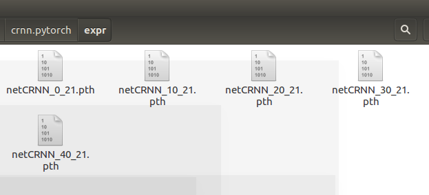

### 项目实现技术栈

* 文本检测算法为CTPN
* 文本识别算法为CRNN+CTC
* UI界面实现为Tkinter

使用软件主要有Ananconda搭建Python运行环境，CUDA作为GUP训练运算平台，IDE为Visual Studio Code。

使用的深度学习框架CTPN为TensorFlow，CRNN为Pytorch。
编程语言主要为Python3.6。部分代码语言为C。

训练环境搭建在Ubuntu 16.04在，检测及识别环境通过编译文件，实现在Windows 10上的正确运行。

### 项目实现思路介绍
本套系统使用CTPN+CRNN进行实现。大体思路为通过CTPN进行银行卡图片中文本信息的位置检测，通过算法获取并切割出银行卡号图片，再将该图片输入到已经训练好的CRNN神经网络中进行识别，最后输出结果给前端UI。


### 卡号识别的实现步骤和介绍：

#### 处理不定长字符定位与识别时的思路：
由于银行卡背景的多样性和复杂性，使用传统图形学算法难以进行降噪处理以及提取出数字的特征信息，因此最终选择使用CRNN进行端到端的数字识别，无需再对单个数字进行切割和识别。

#### 数据增强方式：
包括对图片的仿射变换，增加噪声，图片模糊处理，亮度的调节等

#### 数据预处理与后处理:
首先，将原始的训练图片划分为训练集和验证集。由于原始训练数据图片的正确标签为图片文件名，因此在训练之前，需要使用正则表达式将图片正确的标签进行提取存储。
之后，将分类好的图片数据转化为LMDB文件。数据后处理包括选择出CTPN检测出的银行卡号区域，算法返回图片的边缘处理，PIL格式和OpenCV格式的转变等。

---

### 项目实现流程介绍
#### 项目流程图：


#### 环境配置搭建：
Anaconda：  
为了更好的解决python包管理和Python不同版本的问题，我选择使用Anaconda进行安装搭建总体环境 （可以便捷获取包且对包能够进行管理，同时对环境可以统一管理的发行版本。包含了conda、Python在内的超过180个科学包及其依赖项。）  
创建新的Python环境并安装环境所需的各种库，包括opencv, tensorflow, numpy等。
 

CUDA：  
为了在识别以及后期进行训练时更加高效，我们需要使用到计算机的GPU，在对crnn进行训练时，需要单独安装CUDA。（CUDA（Compute Unified Device Architecture），是显卡厂商NVIDIA推出的运算平台。 CUDA™是一种由NVIDIA推出的通用并行计算架构，该架构使GPU能够解决复杂的计算问题。 它包含了CUDA指令集架构（ISA）以及GPU内部的并行计算引擎。 ）
包括CUDA，cudnn，cudatoolkit三部分。
 
Pytorch：  
Pytorch是torch的python版本，是由Facebook开源的神经网络框架。与Tensorflow的静态计算图不同，pytorch的计算图是动态的，可以根据计算需要实时改变计算图。
 
其他库还还包括tensorflow，cython等，不依次列举。
 
 
#### CTPN配置：
CTPN介绍：  
参考代码来自GitHub仓库：https://github.com/VRCEUS/text-detection-ctpn.git
 
关于CTPN原理及其实现：  
对于复杂场景的文字识别，首先要定位文字的位置，即文字检测。
CTPN是在ECCV 2016提出的一种文字检测算法。CTPN结合CNN与LSTM深度网络，能有效的检测出复杂场景的横向分布的文字。-引用自文章 <https://zhuanlan.zhihu.com/p/34757009> 

 

配置流程：  
由于参考代码是适用于Linux平台，在这里我对该CTPN网络进行了部分修改以迁移至Windows平台进行运行。
核心是对lib\utils\bbox文件夹中的部分pyx文件使用cyphon编译成pyd文件

修改编译脚本


在文件lib \ utils \ bbox \ nms.pyx的第25行进行一些更改“np.int_t”更改为“np.intp_t” 
否则出现“ValueError：Buffer dtype mismatch，expected'int_t'but get'long在步骤6中“长”。


cd到编译路径，进行编译


最终编译出的完整文件


 
（Cython是让Python脚本支持C语言扩展的编译器，Cython能够将Python+C混合编码的.pyx脚本转换为C代码，主要用于优化Python脚本性能或Python调用C函数库。由于Python固有的性能差的问题，用C扩展Python成为提高Python性能常用方法
来自 <https://www.jianshu.com/p/fc5025094912> ）


### CTPN检测效果演示：
原图
 

文本检测结果图

 
检测的文本定位数据

 
八行分别是检测出的八个文本区域。每两个数据x和y构成区域的一个坐标点，四个坐标定位一个区域，最后一项为获得的分数。
（注：由于CTPN的训练需要大量的文本区域标注数据，此处由于无法获得数据，因此使用的是用他人提供的已经训练好的神经网络）
 

银行卡号区域的获取：
此处我选择了一个简单的检测方式，即使用检测出的文本长度作为判别依据。由于银行卡号几乎都是卡面上最长的文本区域，因此这种方法基本上是可行的。

检测方法：getcardpos()
 
切割方法：right_ctpn()  （代码对图片区域进行了误差弥补，以保证获取所有文字区域）

输出检测效果：
 


---

### CRNN配置：
采用的是CNN+RNN+CTC(CRNN+CTC)框架实现文本识别。

 
 
CRNN网络结构 <https://zhuanlan.zhihu.com/p/43534801> 
 
#### 实现环节
* 首先使用CNN提取图像卷积特征
* 然后LSTM进一步提取图像卷积特征中的序列特征
* 最后引入CTC解决训练时字符无法对齐的问题

#### CRNN配置步骤：
要最终实现使用CRNN进行文字识别需要两个步骤，分别是识别与训练。

训练部分：  
CRNN的训练部分实在Linux上实现的。步骤大致分为：

* 环境搭建
* 数据增强
* 数据集制作
* Crnn网络参数调整
* Crnn网络训练

环境搭建：  
该网络是借助于Pytorch框架实现，使用GPU来加速网络训练。
为了便于管理Python版本和包，在Linux上依旧采用了Anaconda。
创建的DL环境，安装CUDA，Torch7, fblualib 和 LMDB等。


#### 数据增强：  
1. 图片仿射变换
使用opencv的getAffineTransform：由三对点计算仿射变换，
cv2.getAffineTransform(point2,point1)
2. 图片增加噪声
将图片以array的形式存储,随机增加噪声,转回原形式
3. 图片模糊
使用Pillow库的图片模糊，PIL.BUR
4. 改变亮度，
使用Pillow库的改变亮度，


#### 数据集制作：
数据增强之后，需要将图片制作成LMDB数据集，便于后续数据的读取处理。  
由于使用的数据图片其正确标签是其文件名，因此需要将图片的标签再单独提取。使用正则表达式来提取图片正确的数字标签。  
加载图片路径，使用其中的图片分别制作训练数据集和验证数据集
 
打印的测试结果
  
 
这时已经生成lmdb数据集


#### 代码编写与调整：

Crnn网络参数调整：

学习率调整。在初次训练时，由于学习率过大，导致网络无法收敛。调节为0.0001后可正常收敛。
 
BatchSize调整。BatchSize需要选择为2的次方数，过小可能导致局部网络梯度方向与整体相反。过大则会降低网络的训练效率。
 
指定训练集和验证集路径
 
训练次数epoch，决定整个数据集需下训练多少次
 
TrainBatch函数对Batch进行训练，并返回损失。
 
打印参数为displayInterval  
验证参数为valInterval  
保存参数为saveInterval  
 

定期对训练模型进行保存，并决定训练效果在终端的显示间隔以及对训练模型进行验证的间隔。
  
 
 
对训练中验证结果截图，如当前准确率为0.65
   


生成的模型
   


### 识别部分：

定义分类标签表
   

将GUP训练模型的权重提取转变为单个CPU可用（因为模型是使用GPU训练的，但我却是使用CPU运行的）
   

在Begin()中调用CTPN检测接口right_ctpn()和CRNN识别接口crnn_get()
   
right_ctpn() 对银行卡号区域进行检测并返回输出图片。  
crnn_get() 对输入的卡号图片进行识别


crnn模型加载方法：crnnSource()

crnn识别方法：crnnOrc()
 

返回的CTPN检测结果：
   
 
输出CRNN识别结果：
   
 
6222601310012850053

---


### UI实现：

UI使用了Python GUI 库Tkinter。Python 使用 Tkinter 可以快速的创建 GUI 应用程序。
Tkinter 是 Python 的标准 GUI 库。Python 使用 Tkinter 可以快速的创建 GUI 应用程序。
由于 Tkinter 是内置到 python 的安装包中、只要安装好 Python 之后就能 import Tkinter 库、而且 IDLE 也是用 Tkinter 编写而成、对于简单的图形界面 Tkinter能够应付自如。

Opencv
OpenCV是一个基于BSD许可（开源）发行的跨平台计算机视觉库，可以运行在Linux、Windows、Android和Mac OS操作系统上。它轻量级而且高效——由一系列 C 函数和少量 C++ 类构成，同时提供了Python、Ruby、MATLAB等语言的接口，实现了图像处理和计算机视觉方面的很多通用算法。

前端代码实现
button_load（上传文件）函数选择要进行识别的文件，选择完图片后将文件的地址传入区域识别函数，进行图片字符区域的定位。

同时将上传的图片展示在窗口，由于图片尺寸不统一，使用opencv里面的resize函数将上传的图片进行尺寸调整，长度超过500的将长度调整到500，在检测宽度将宽度超过300的调整为300之后显示在窗口的指定位置

Button_orc 函数将图片地址传到识别区域模块，并将识别后的图片获取到图片的地址之后加载到区域识别栏，并将获取到的识别结果输出到label_out区域：
    


在编写UI前，需要将CTPN，CRNN以及UI界面进行整体的整合。将CRNN和CTPN整合到Begin()方法中。  
在前端UI点击方法中，调用识别方法，将图片识别结果进行返回。


上传测试图片文件，获取识别图片文件路径以及显示图片，点击开始识别，输出文本检测区域，以及文本识别结果：


   


---


### 项目中卡号定位与卡号识别结果说明
在控制台打印的输出信息：

检测图片路径：  
G:/Homework/BankCardIdentifier/data/test_images/2.jpeg

花费时间：  
cost time: 1.44s

CTPN检测结果输出存储路径：  
text_detection_ctpn/data/res/2.txt

银行卡号图片区域坐标及得分：  
['80', '356', '704', '356', '704', '418', '80', '418', '0.99938583\n']

CRNN识别结果：
6222601310012850053


---
 
### 项目代码介绍文档

#### 代码部署步骤介绍

首先根据readme.md安装配置必须的环境

CTPN部署：  

需要对所有模型及图片的引用路径根据自己环境的不同进行修正。  

执行```setup_new.py```文件  
修改部分代码，大致步骤在项目文档中已经说明。  
最终对```BankCardIdentifier\text_detection_ctpn\utils\bbox ```中的**bbox.pyx**和**nms.pyx**文件进行编译。生成**bbox.cp36-win_amd64.pyd**和
**nms.cp36-win_amd64.pyd**文件(不同环境编译的文件名称可能不同)

CRNN部署：  

 根据训练数据和目的的不同，修改**alphabat**中的参数，修改crnn模型的输入参数(如相同，可无需修改)

 训练时指定的模型路径，以及训练集，验证集路径。

 此项目流程是Ubuntu 16.04系统下GPU训练模型，转到Windows 10系统下使用单CPU加载改模型进行识别。

 数据集创建


#### 代码运行步骤介绍

启动ui.py   
上传图片，点击识别，即可输出结果


#### 代码说明

text_detection_ctpn文件夹包含所有的CTPN代码及配置文件

CRNN文件夹包含所有的CRNN识别运行代码及配置文件

crnn.pytorch文件夹包含所有的CRNN训练相关代码及配置文件

其中，crnn.pytorch运行环境为Ubuntu 16.04
text_detection_ctpn和CRNN运行环境为Windows10

根目录中，ui.py为图形界面代码，执行后可直接在图形界面选择图片进行识别

demo.py为程序执行入口，调用其中的Begin()方法进行识别。也可单独执行demo.py在控制台终端输出运行结果。

Begin()方法中，right_ctpn()方法返回参数路径指定图片检测到的文本定位信息，crnn_get()方法输出图片的识别结果

text_detection_ctpn\text_detect.py文件主要是对CTPN检测后输出的原始数据进行处理。包含getcardpos()和right_ctpn()两个方法。

CRNN\model.py文件主要是调用CRNN\crnn\crnn.py中核心的识别方法crnnOcr()。

训练开始前，需要先运行crnn.pytorch\train\create_dataset\create_dataset.py，指定训练集图片和验证集图片，从而创建训练集数据和验证集数据。输入输出路径需要自己指定。其中getrightword()方法作用是提取图片正确的标签。

通过执行crnn.pytorch\train.py文件，即可开始对crnn网络开始训练。但在训练之前，需要自己对其中的参数进行自定义工作。包括alphabet，trainRoot，valRoot，batchSize，saveInterval等。开始运行后，即可在终端查看训练过程中输出的信息。crnn.pytorch\train.py中val()作用是对神经网络进行验证，并输出验证结果，得分和准确率。trainBatch()方法返回训练的损失。


#### 参考代码：  
<https://github.com/meijieru/crnn.pytorch>
<https://github.com/xiaofengShi/CHINESE-OCR>
<https://github.com/eragonruan/text-detection-ctpn>
<https://github.com/bay1/card-crnn-ctpn> (飞爷tql)

---

### 环境配置：

1. Ananconda
2. python3
3. tensorflow/tensorflow-gpu
4. numpy等库
6. GPU
7. CUDA
8. Pytorch  
...

(还有一些细节没有写，不过问题都不大，基本都是能查到的，那就不写了)