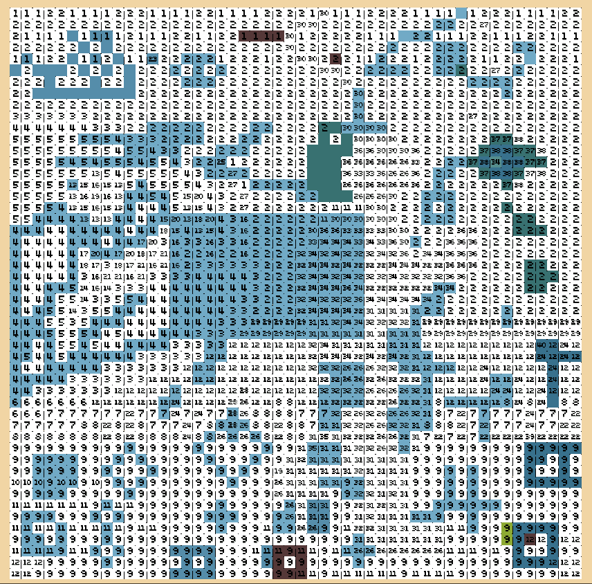

### 节奏像素？

首先，最早是在考虑如何可以把经典游戏进行玩法上的创新，后来思考出来的其中一个点子就是这个。  
这个玩法大概是我觉得其中可行性最高的，并且相对来说对玩家有一点意义的。

虽然本质上这还是一款没什么重要意义的，不过玩法可能会有一点创新的绘画&音乐游戏。

#### 关于这个游戏的玩法状态设想：

玩家随着游戏的音乐节奏以及画面上的效果提示，不断的准确点击和滑动，就能创造出点和线，最后呈现一副像素画。  
（终极形态想法是，任意一副像素画和任意一首音乐搭配，都能组合成一个可以任意完成的关卡。根据音乐的每一刻，能够根据当前的节奏，在当前的画面适配出位置合适的多个像素点或者路线即时显示，玩家可以任意选择进行操作。下一个点完成后，继续分析生成往复，等于自动的谱面生成器。---似乎太难实现，不过想法还是放在这里---目前还是设计固定谱面）

#### 像素画大小要求与区别：

表现单个抽象物体的最低要求在10^-20^之间。

表现抽象场景的最低标准是 32^(抽象的背景和事物)

50^可以表现能明确识别的物与景。（关卡最低标准）

100^可以表现出具体细节。

200^以上可以达到接近插画的效果。

(^=^2)

#### 颜色相关：
颜色数量种类约20开始，能表达较丰富的色彩画面。

#### 以绘画模式为基础进行设计：
在移动端屏幕上，考虑到交互操作，画面比较适合显示像素区域的大小为 10*16 左右。  
PC端上，鼠标进行交互，显示范围可以相对更大。

#### 交互方式：
点击，直线滑动，曲线滑动，折线滑动。

#### 视觉引导：
需要在视觉上提前于音乐节奏进行引导，让玩家知道下一步操作应该是什么。
（参考Cytus II中的引导横线实现的功能）

---

### 算法实现：

#### 像素处理：

对所有像素颜色数量进行统计。  
在保证画面可视质量的情况下，保留20种以上颜色，对每种颜色按顺序编号。（保存记录对应的RGB值）  
建立一个颜色索引表，不同颜色的变化越小，则其编号也越接近。目的是保证后期画面在不同颜色过渡时，能够准确实现。

生成对应大小矩阵，每个矩阵单元保存一个像素信息。

分析对应关卡的音乐，提取节奏信息。

（在自由模式，无预设定情况下）

#### 在画面中的每一个点有可能有三种状态：
* 点状态：  
（孤立的点，八连通域中无相同编号）

* 线状态：  
（定义一个线状态中，所有点是八连通的。且所有单元共用边数量和小于或者等于单元数量和）

* 块状态：  
（定义一个块状态中，所有点是四连通的。且所有单元共用边数量和大于单元数量和）

高状态兼容低状态（如块兼容线，线兼容点）  
状态的优先级依次增加，块状态优先级最高。如果一个点具有优先级更高的状态，则暂时不考虑低状态。  
每个状态中，所有点的颜色编号是相同的。

计算时，先计算单元点是否先满足高优先的状态，若满足，后续计算低优先状态是将其排除；若不满足，则后续再考虑是否满足其他状态。

对于已经正确填充的像素点，进行标记无色，无色自身状态不参与状态计算，但是其他颜色计算状态时，将无色像素单独考虑为一种颜色进行计算。

简略的一些可能状态区域图，与数字无关

#### 具体计算步骤：

	1. 统计处理后每个像素种类的数量。从大到小建立一张索引表。

	2. 先选择数量最多的编号种类像素，随机选择一个进行扩展。以四连通方式拓展区域，直至没有4连通点。完成后统计共用边数量。

	3. 若数量大于像素点数量，则给其中的每一个像素点在对应矩阵中标记 块状态 标示。记录当前已标记的该编号像素点总数，然后转到步骤7。

	4. 若共用边数量等于零，则再次查看8连通区域，若8连通区域中没有同编号像素点，则直接给该像素点在对应矩阵中标记 点状态 标示。记录当前已标记的该编号像素点总数，然后转到步骤7。否则若存在同编号像素点，则先对自身标记为不确定点，同时单独计数，再转到步骤5。

	5. 若数量为其他（等于或小于），则给其中的每一个像素点在对应矩阵中标记 线状态 标示。记录当前已标记的该编号像素点总数。  

	6. 上述步骤的每一个块状态区域和点状态区域进行单独的状态编码。如第一个块区域记录为B1，第一个点(区域)记录为D1，依次增加编号。其中，线区域比较难以计算，因为会存在单独8连通线状态像素点，所以在所有其他区域点状态确定后，再确定自身的状态。  

	7. 若标记总数小于索引记录数量，继续选择下一个未标记该编号像素点进行状态计算。若标记总数等于索引记录数量，则开始识别不确定点的状态。

	8. 对于每一个不确定点，都先都是独立的，其次在它的8连通区域里面都至少存在一个点，这些点的状态可能是块状态，线状态或不确定点状态。
    如果只有块状态，则将自身状态设置为点状态，并进行编号D*。
    如果只具有一种线状态，则将自身状态设置为这个线状态的编号，如果存在多种线状态，将所有线状态合并，编号向前统一。
    如果只存在不确定点状态，则将区域内所有不确定状态的点设置为线状态并新编号L*，若不确定点状态与线状态同时存在，不确定点状态同步为线状态编号。
    当所有点状态确定，继续选取下一个索引编号的像素点进行状态计算。

	9. 所有索引状态计算完成，全部记录在矩阵中，为之后的利用做基础。

---

### 音乐处理（待补充）：

好多乐理都忘记了。。。感觉不太写得出来。

大致想法：  
在上一步，将点，线，块都区分完成后，就可以进行一定的可视化了。  
每一个点，定义为点击，  
每一条线，定位为滑动，  
每一块区域，可以点击和滑动结合。

这个环节，需要将音乐进行拆分，生成谱面。  
以简谱来说，根据每个音的高低和时值不同，对应成点，线或块。

需要点击以及滑动的时候，画面都会出现亮点(UI)进行提示，玩家需要在节奏时间内，对应节奏时间点击或滑动，然后在对应的触发位置，就会成功出现画面颜色。

这方面还是需要音乐大佬来指导啊。

---

### 设计相关（待补充的和思想原型）：

线段的抖动修正强度

操作引导UI

得分计算与时机判定

简化玩家的操作

对每一副像素画进行单独的关卡设计。  
对像素画不同的区域和线条进行预先的标记。  
（或者说，每个单独的像素都是一个标记点）

在游戏的过程中，通过引导或者自由随机选择触发起始点。  
接下来，会在一定的时间内（可能具有音游的时效性），出现下一个标记点的位置信息。玩家需要滑动至下一个标记点。   
操作正确完成后，玩家即成功的绘画出线条。

关于曲线的处理-两个标记点之间可以出现透明效果的曲线提示。
关于色块的处理-一定程度的奖励，比如，连续准确完整点击或滑动操作，则奖励自动填充整个色块。
关于单独色点的处理-点击操作
（点击与滑动交互都具备）

是否考虑颜色属性？
可以作为提高游戏系统复杂度的一个维度。
但是不作为玩法设计的必要条件

规则的限制：绘出的线条不能与已画的线条相交