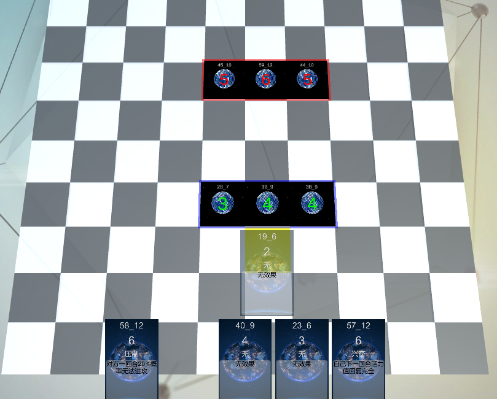
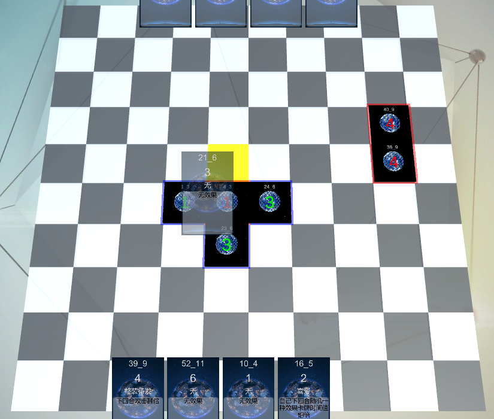
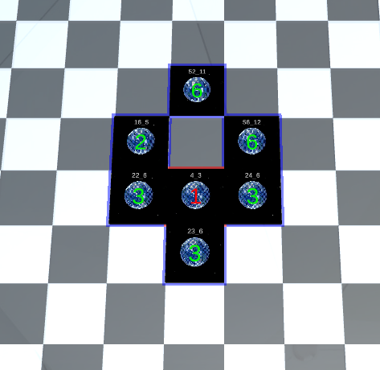
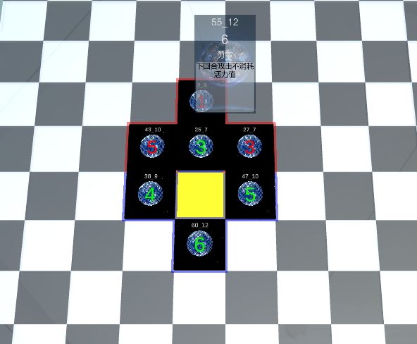
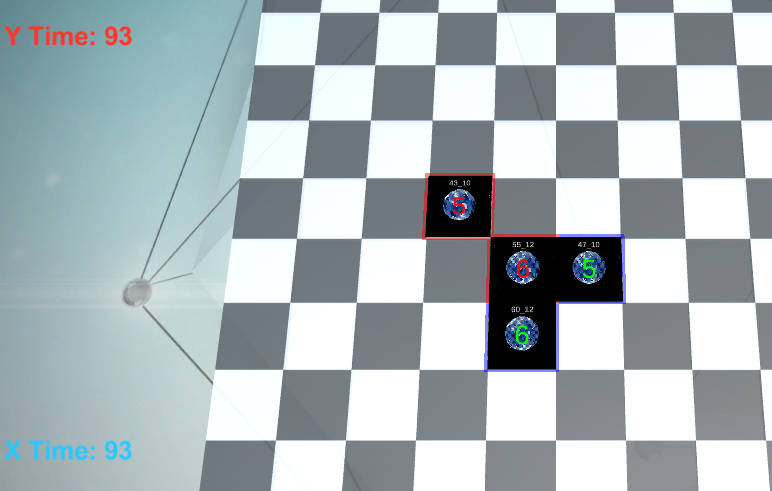

CardGO设计日志：<https://vrceus.github.io/Card-GO-Design>  

### 游戏说明：

CardGO 是一款结合了卡牌，消除与围棋的游戏。
实际上，该玩法初衷是作为另一款游戏的内部的一个系统存在，不过CardGO也能作为一个单独的游戏进行游玩。

#### 卡牌说明：

* 每张卡牌具有名称，时间值，效果名称及描述等属性。
* 时间值数值大小范围为1-6（根据测试可调整）。
* *卡牌效果还未实现。*

#### 棋盘说明：

* 棋盘由为10*10的正方形单元区域组成（根据测试可调整）。
* 卡牌（之后称为卡棋）可以使用鼠标拖动至任意一点空区域进行放置。
* 棋盘的每个单位具有地形元素，拥有各自的效果。
* *棋盘地形功能还未实现。*

#### 自定义模式说明：
* 可以设置双方初始生命值（合理大小皆可）
* 可以设置地图的大小（合理大小皆可）
* 可以设置双方的手牌数量（合理数量皆可）
* 可以设置出现卡牌的最小值和最大值范围（目前为1-10）

##### 预览辅助模式：

默认开启。当拖动卡牌至所选区域上方且未放置时，会预览显示如果卡牌放在此位置周围周围将会生效的卡牌，表现状态为透明。

##### 全速连通模式：

默认关闭。计算连通数时，将会计算所放置的卡牌本身。因此，如果放置数值为1的卡牌，将会直接生效。

##### 邻接落子模式：

默认关闭。卡牌只能放置在场上已放置棋子的八邻接区域。当场上没有棋子时，可以任意放置。

##### 人机对战模式：
默认关闭。开启后与AI对战。目前还较为初级，后期会继续优化。

### 规则说明：

* 玩家开始时具有卡牌5张，每回合可以使用一张，新的回合获取一张。
* 双方具有初始时间值/生命值100点（根据测试可调整）。
* 胜利条件为另一方的时间值为0。
* 四向连通区域：指的是从区域上任一点出发，可通过上、下、左、右4个方向上的移动组合，到达区域的任意一点；
* 八邻域：以一点为中心，其上、下、左、右，左上，左下，右上，右下，8个方向上的邻接区域；

##### 规则1：
当落下一个棋子，计算该棋子的同阵营四连通集总数量-1（不含该棋子本身），设为X。如果该四连通集中的棋子时间值小于等于X，则该棋子将从棋盘上消除，并给对方造成对应时间值的伤害。

示例1

示例1

当卡牌19-6放置在黄色区域时，构成了四连通集，数量为4个。其中由于时间值为3和时间值为2的卡牌由于小于4，将会被消除，并给对方造成3+2点伤害。因为时间值为4的卡牌不含自己的四连通数量为3，所以不会被消除。

##### 规则2：
如果落下的棋子如果包围另一方的棋子且是无气状态（同围棋规则，即该棋子上下左右都是对方棋子或边缘），则无气的棋子被临时转变为落下棋子阵营，再计算四连通集。
如果无气棋子时间值大于X，则表示无法被消除，转变回原状态。

示例2

示例2

当选择的卡牌21-6放置在黄色区域时，被包围的对方红色棋子呈现无气，将会被临时转变成绿方的卡牌进行连通集计算。

示例3

示例3

在这种情况下，虽然红色的棋子1被绿色棋子包围，但由于1的上方有气（空区域），所以将不会被转化阵营。但是如果这个空区域被绿色棋子填上，则会被转化；如果被红色棋子填上，则两个红色棋子都会被转化。（另外，在此图中，由于被包围的红色棋子时间值是1，因此填上红色棋子后虽然被转化，但是红色棋子本身也构成可消除的四连通集，会对绿方产生伤害）

##### 规则3：
如果出现劫（同围棋规则），则无气的棋子在连通集计算时，将会被各自被算作另一方的棋子。连通的对方棋子将同样会对我方造成伤害。

示例4

示例4

当红色卡牌55-12放置在黄色区域时，该卡牌被绿色棋子包围且无气；而时间值为3的绿色棋子也将会被红色的棋子包围且无气。此时双方会同时计算连通区域并互相造成伤害。红方将给绿方造成3+3+1的伤害，绿方将给红方造成3+4点伤害，回合结束后对应的棋子将被消除。另外，由于红色棋子55-12虽然被绿方棋子包围并转化，但连通集数量为5，因此无法被绿方消除，回合结束后，其仍然是红方棋子。

计算结果如图，双方各自收到7点伤害

示例5

---

#### 部分卡牌效果一览：

    0	无	N	无效果
    1	放纵	N	可以额外打出一张时间值为本卡牌时间值+1的卡牌
    2	勇敢	N	随机将对方场上的一个棋子转化为我方棋子
    3	高兴	N	该卡棋生效所需的连通数-1
    4	骄傲	N	可以额外打出一张时间值为本卡牌时间值-1的卡牌
    5	悲伤	N	直接额外给对方时间资源减少0~X点时间值，X为该卡牌时间值
    6	痛苦	N	直接额外给对方时间资源减少本卡牌时间值
    7	善良	N	增加等于这张卡牌时间值的己方时间资源
    8	孤独	N	这张卡牌不会被对方连通
    9	喜爱	N	打出时，额外抽取一张卡牌
    10	压制	N	本卡牌在场上时，其下方的那张卡牌将不会生效
    11	兴奋	N	可以额外打出一张时间值等于本卡牌时间值的卡牌
    12	邪恶	N	放置时，随机摧毁该卡牌四邻域中的一张卡牌

#### 部分地形效果一览：

    0	无	N	无效果
    1	土地	N	基础地形
    2	草地	N	基础地形
    3	荒地	N	基础地形
    4	水	N	基础地形，但是与其他的地形隔离
    5	石头	N	无法放置棋子，等同于边缘
    6	地穴	N	放置的棋子直接消失
    7	沼泽	N	放置的棋子时间值-1
    8	高地	N	放置的棋子时间值+1
    9	灌木	N	放置的棋子连通数+1
    10	冰面	N	放置的棋子连通数-1
    11	草丛	N	放置的棋子会被隐藏
    12	树木	N	无法放置棋子，但会被计算连通数
    13	花朵	N	放置的棋子时间值和连通数+1
    14	火焰	N	放置的棋子立即生效，但是时间值减半

