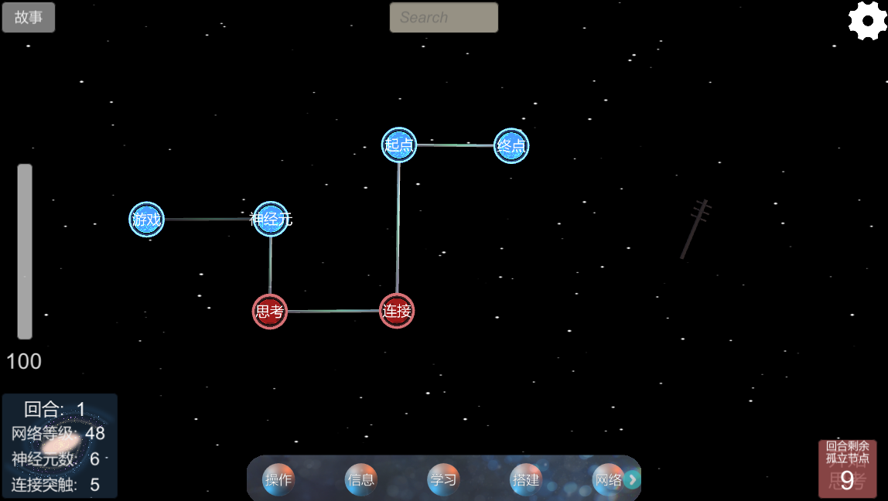
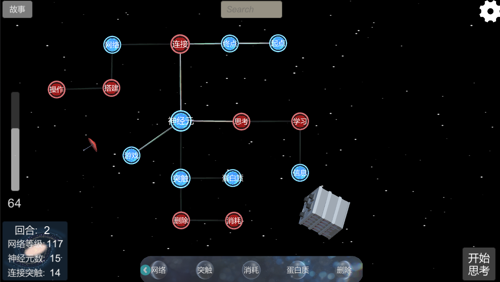
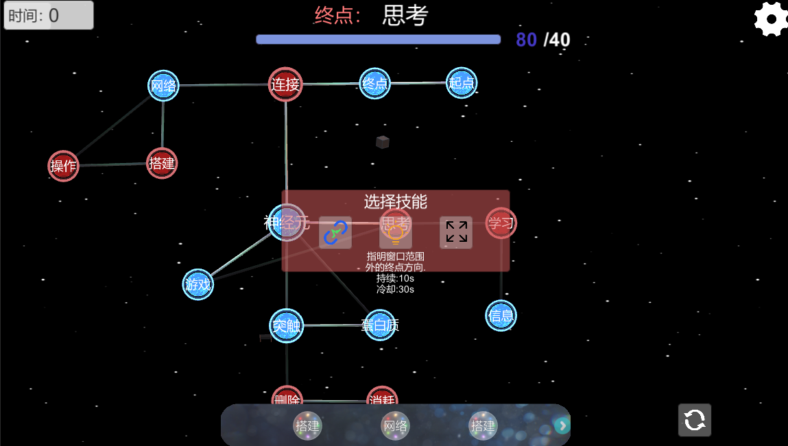
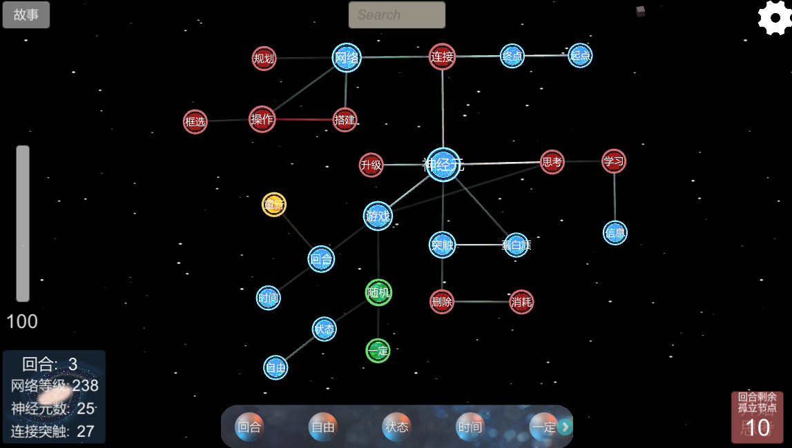

这篇博客主要是对实验性的游戏“Neurons(神经元)”进行的简单概念说明。

---

Neurons

---

### 关于思考：

Neurons是一款尝试探索人类思考行为的游戏，它的核心设计理念在于模拟大脑中神经元的运行方式，通过可视化的游戏形式向玩家阐述和揭示日常的思考是如何发生的。

### 神经元与突触：
我们借助于语言进行逻辑推理，而构建一个语言的基础必然是词汇。词汇则是对一段信息的高度抽象概括。  
一方面，我们用语言来映射表达现实。例如，对于什么是“神经元”？当我对别人说起这个词汇的时候，并不需要去解释或定义什么是神经元，因为那个人已经理解与明白。除非一个人之前从来没有了解过这个词汇，不过当通过一长串其他的语句信息向其解释完整的概念定义后，在下一次说起“神经元”的时候，就无需重新解释了。而我们用无数的词汇就这样构建了自然科学的空间。
另外一方面，我们使用语言进行逻辑推理与思考，最简单直接的例子当然是数学，数学显然是一门完全依靠逻辑性的形式语言，当我们说起1+1的时候，自然会推理得出2。当然，得出2的结果可能并非依靠逻辑，而是因为被强化的联想。就思考的行为来说，这一点其实与计算“3\*5+7-1并没有什么差异，只不过一个是1+1=2，另一个是3\*5=15, 15+7=22, 22-1=21, 所以3\*5+7-1=21。本质都是联想的过程，不过一个只联想了一次，另一个多了几次而已。  
当我再次问起3\*5+7-1等于多少时，大概你已经直接得出21的结果，此时它与计算1+1的过程甚至是相同的。

现在我们回到日常生活所使用的交流语言上，会发现它照样是靠联想来运作的。  

一个例子，既然有“终点”，那么还会想到有什么？
对于我而言，我想到的是“起点”。之所以会是“起点”，是因为这两个词汇已经在我大脑中形成了相关的深刻记忆。  
对于其他人而言，想到的也许是其他的词汇概念，不过无论是什么词汇，都几乎必然是与“终点”意义相关的词汇（说几乎是因为可能会被思考时所处的环境影响）。  
需要说明一点，我的大脑之所以能从“终点”首先联想到“起点”，并非是我从意义上推理它们具有相近性（即使我可以解释它们具有关联的意义），而完全是因为这两个词汇总是在一起出现（在上面的那张图片中它们是相连的）。  
至于不同的人会由“终点”可能想到其他的不同词汇，也正是由于对不同的人而言，可能“终点”与“结果”比起“终点”与“起点”，在其所看过的故事中给了它更深的印象。

词汇信息通过记忆联想到达另一个词汇信息，正如神经元电流通过突触递质激活另一个神经元。

### 可视化的网络

我们的记忆在不断的新增与遗忘，我们每个人的知道的与想起的都完全不同。
显然，每个人的神经元所构成的记忆网络都是完全不同的。

按自己的想法构建不同的神经网络，这点是“Neurons”的重要特性。
玩家可以在任意调整节点的位置，也可以任意连接想要连接的节点。随着游戏流程的推进，最终搭建出独特的神经网络，并且这个网络与玩家大脑中的那个联想网络是相互映射的。

任意搭建的网络

### 关于玩法

毫无疑问，这个游戏的核心玩法是将自己脑海中的网络可视化的构建。不过这本身或许缺乏趣味性与难度，因此游戏为玩家提供了其他挑战，当然也是为了更好的让玩家体会到自己思考联想的过程。
具体在游戏中已经说明，这里暂且不表。除了当前已经实现的一个玩法外，还有另一个更有趣的玩法会在迭代后推出。

完成回合挑战后获取新技能

### 规划
这个游戏目前初版Demo已经完成，因为是比较实验性的游戏，流程不是很长。计划会继续进行迭代，除了美术优化之外，还有新的玩法以及模式会在过一段时间完成。

节点不多但已具有雏形的神经网络
