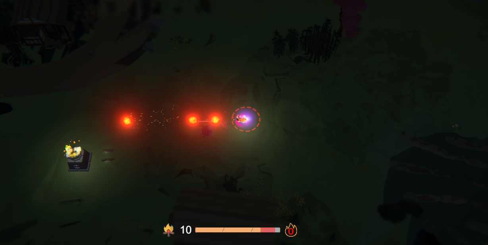
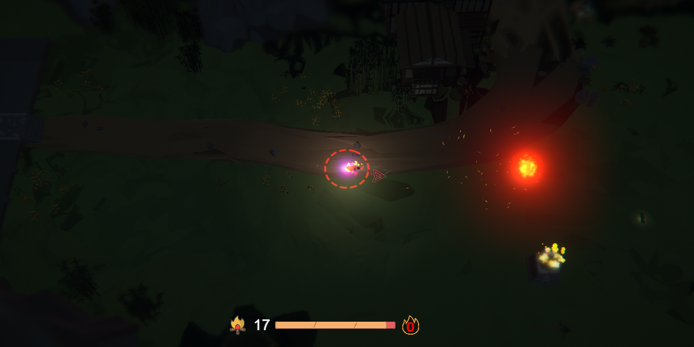
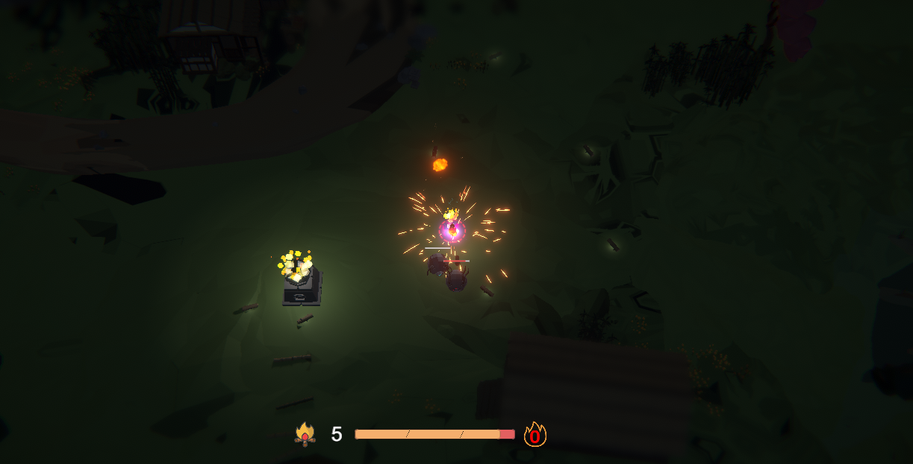
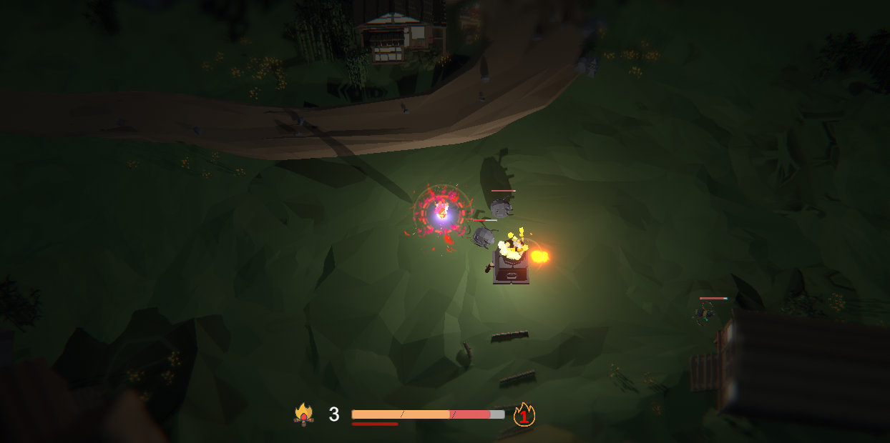
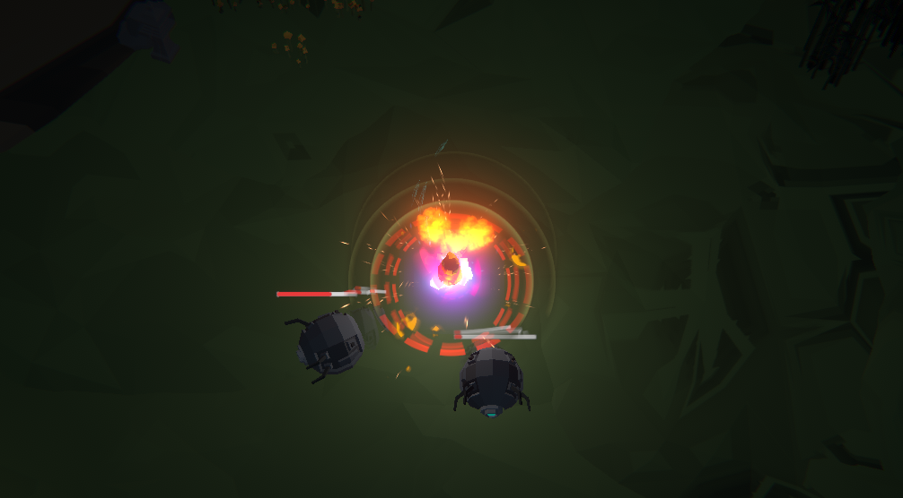
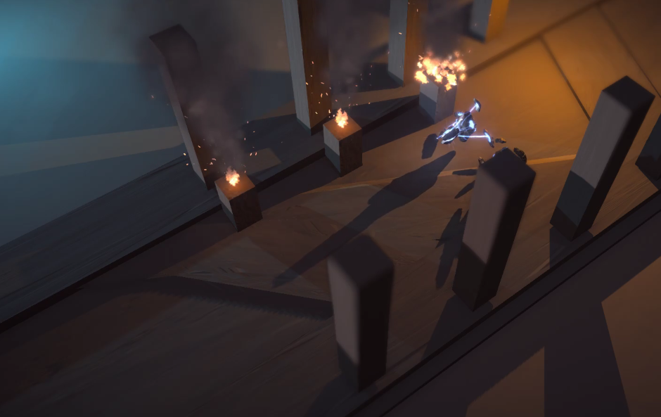

Entropy/熵(暂定名)的短期设计开发小结。

2月份主要在做另外一个Idle游戏，然而因为数据设计的比较复杂暂时会搁置一段时间，3月的计划是先继续优化打磨下Entropy和Neurons，以及为另外一个新游戏（偏AVG）的设计开发工作做准备。

---

### 关于Entropy：

Entropy是一款俯视角游戏，目前对后续的打算是设计为一款zelda like游戏，核心体验元素是十分常见的冒险，战斗以及解密。

这里可能有的人会疑惑，这款游戏存在的意义是什么，创新点和竞争力在哪里？
emmm，其实我挺不好解释的，因为“战斗节奏的不同”这种说法连我自己都觉得挺模糊。

小火球

大火球

### 主要设定：

回想一下常见的游戏，也许有接近一半的吧，都具有这样三个要素：生命值，魔法/精力，金钱/资源。
那么Entropy这个游戏，并不意外，它也有这三个元素，不过好在还是有一点不同的，就是它们三个被绑定在一起了。

需要说明的是，设计时并非故意或强行将它们绑定在一起的，而是从一开始的概念设定出发，这样设计似乎就是最为合理的。

### 一个火焰：

>从前有一个火焰，作为火焰，最重要的事当然是燃烧了。可是要燃烧的话肯定需要烧点什么东西，这个火焰比较喜欢烧柴，所以它为了给自己续命，就必须要去找点柴薪来烧，可以光是在地上捡柴的完全不够烧啊，所以小火焰就决定去烧一些其他东西，比如那些为了保护森林安全而总是想着灭火的“消防员”。  
>可是别人可不会乖乖的等着被烧，那没办法，小火焰只能决定暴力一点去强行烧了，比如向它发个火球啥的。可是发射出火球后，小火焰只感觉到身体产生了一种难以描述的空虚，好像自己永远失去了一部分。它努力想了想，突然明白了一切，原来火焰-火球=小火焰。

在上面的这个故事中，火焰是玩家在游戏中所扮演的角色，消防员是想要消灭玩家的敌人，续命要烧柴薪是游戏中的金钱和资源，所续的命就是让火焰燃烧的更久，而一个火焰想发射火球的话，那自然得把自己的一部分发射出去。

被击中的火焰

### 不同的节奏与体验

自此，由于是一个火焰，生命，魔法和金钱这三者最终不可割分。  
玩家可以选择一直攻击，不过打着打着可能就把自己给打没了；玩家也可以选择不攻击，不过烧着烧着可能就把自己烧完了。  
这种出自于火焰自然的特性，给玩家带来了与一般战斗游戏完全不同的战斗节奏体验。

然而一个火焰的特性可不止如此，那还有什么？  

#### 火焰说，要有光：

光在游戏中是一个重要的设定，在漆黑的深夜，一个火焰照亮四周的同时，也成为了那些躲在黑暗角落里的敌人的靶子。唯有火焰的光明照亮它之时，那些敌人才将显露其真正面目。

更大的照明范围

#### 除了发光，更要发热。
在游戏中，火焰可以通过各种途径不断积蓄自己的热量，当其达到一定界限的时候，火焰将会燃烧的更加猛烈，拥有更加高的温度，更加亮的光照，以及燃烧得更加块的自己。

#### 助燃
游戏中，只要进行合适的操作，火焰可以被助燃。然后用常用的词汇解释的话，那就是防反。
正确的防反不仅不会受到伤害，还会让火焰自身燃烧的更久。这个操作技巧对于高燃烧状态的火焰是必须要使用的。

防反助燃

#### 其他
另外一些独特的设定，就不详细叙述了。  
例如攻击具有伤害和强度两种属性；火焰的温度设定；随机且变化的技能Build等。

### 规划：
在预计设计中，游戏将分为多个具有特色的区域，并且包含不同的战斗和解密玩法。  
目前只完成了一个战斗场景用于测试和体验游戏主要玩法，后续的关卡和功能已经有新的程序加入开发，以及新的美术加入设计，完成时间看开发的效率和其他游戏的制作进度。

来自大触的怪物设计
